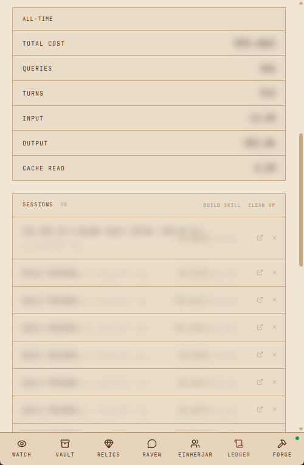
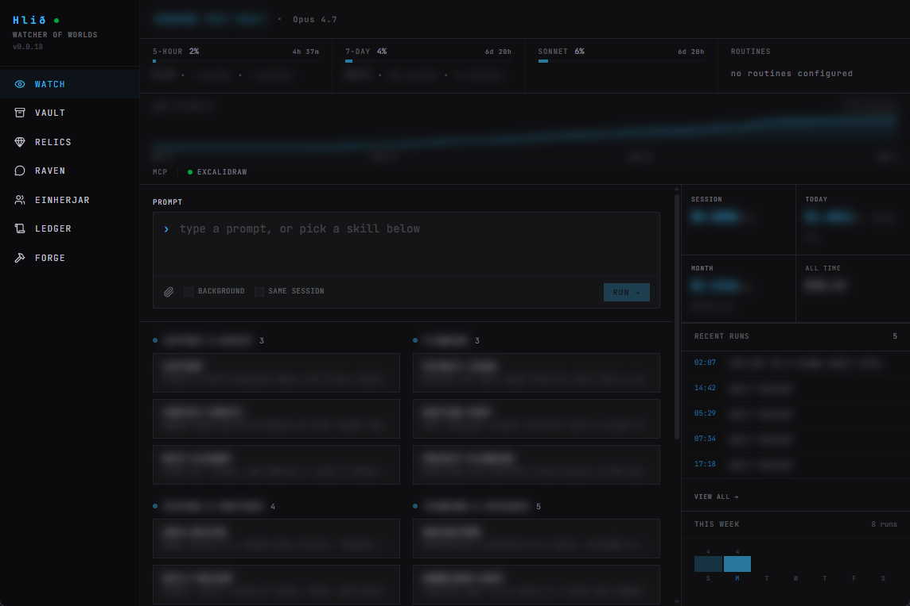

# Hlið

*Short for Hliðskjálf, Óðinn's high seat from which he could see all nine realms.*

`Hlid` is a local command center for your Obsidian vault, powered by the Claude Agent SDK. So you don't need a terminal inside Obsidian, or a `/remote-control` session that breaks on approval prompts while mobile. Chat with your agent, watch tool use, manage your vault and agent settings from one place.

Windows-first, distributed as a single compiled `hlid.exe`. Accessible anywhere via Tailscale. Built for personal use but configurable enough to adapt to other vault setups.

PWA for app-like experience, both desktop and mobile friendly design. Pull to refresh on mobile. There's a privacy toggle that blurs sensitive data like paths and filenames, handy for screenshots. Uses what's on your machine. Dark and light themes (dark theme based on other project [nerdsnipe.wtf](https://nerdsnipe.wtf)).

Session and attachment management, customize agents as personality or working directory, allows vault specific skills and MCP setups.

TLDR: Runs on your Windows machine, works with PARA or LLM Wiki style vaults, allows TailScale setup via your agent, works with WSL, and allows you to control everything from one spot, from anywhere.

Mobile UI:



Desktop UI:



## Skill index.md

Here is how I setup my skills so the home page is split into columns for groupings.

```txt
# Skills Index

Quick reference for all vault skills. Load the full `SKILL.md` only on match.

## Reviews & Routines

| Skill | Triggers on |
|---|---|
| `skill-name` | "use skill x", "process x", "etc" |
```

## Stack

- `Bun` server, single-binary compile (`bun build --compile`) with the Vite client embedded into the executable
- `TanStack Start` + `TanStack Router` for the web UI
- Provider-agnostic `AgentProvider` interface for persistent vault sessions; native Claude and Codex integrations plus any installed Agent Client Protocol agent
- WebSockets for real-time streaming and tool use visibility
- `SQLite` for session and settings storage
- Tailscale for remote access (no cloud needed)

## Setup

```bash
bun install
bun run dev:all
```

`dev:all` runs three processes concurrently: the Vite UI, the Bun API/WS server, and the TLS proxy (only if cert/key paths are configured in `hlid.config.toml`).

First launch asks you to create an app password from the Hlid machine, then opens the setup wizard. Pick your vault folder; `Hlid` scans it and pre-fills the detected structure; you confirm. Config writes to `hlid.config.toml`.

## Config

Everything lives in `hlid.config.toml` at the project root. Vault paths (inbox, projects, areas, resources, archive, skills, memory, outputs), agent model + reasoning effort + permission mode, server port, TLS cert/key paths, local network access toggle, external agent toggle, attachment limits, and registered sub-agents.

See `hlid.config.example.toml` for a minimal starting point. Most settings hot-reload while the server is running. Vault path and MCP changes need a session reload, which you can trigger from `FORGE`.

Turn recaps (`claude.turn_recaps`) are on by default. They mimic the CLI recap feature: a small recap model generates a one-sentence summary enriched with the SDK's built-in turn summary and a list of tools used during the turn.

### Agent Client Protocol agents

The Agent tab in `FORGE` loads the cached official ACP registry and highlights
OpenCode and the Pi ACP adapter. Search the catalog, follow the platform-specific
installation guidance, enable an installed agent, and restart Hlid. Enabled
agents appear alongside Claude and Codex as `acp:<registry-id>` providers.

Hlid never executes registry installation commands and never stores provider
credentials. It displays each agent's advertised authentication methods; agent-
managed authentication can be started from Forge, while terminal and environment-
variable methods show the command or variable names to configure. The last good
registry response is persisted, with bundled OpenCode and Pi entries available
offline.

## Pages

Routes are named after Norse concepts; the sidebar uses the labels in caps.

- **WATCH** (`/`): inbox count, active projects, session status, last query cost. Also has a 7-day and 30-day cumulative token chart, a recent sessions list, and a skills directory pulled from your vault and global Claude skills.
- **VAULT** (`/vault`): file browser with tree navigation. Projects get grouped by status pulled from their YAML front-matter; it uses your custom `status_vocabulary` from config so it matches whatever labels your vault actually uses.
- **RELICS** (`/relics`): attachment management. Ephemeral attachments are scoped to the session they were uploaded in; vault attachments persist. Search by filename or filter by date range.
- **RAVEN** (`/raven`): full back-and-forth with your agent, tool use shown inline and collapsible, tap-to-approve permission cards, attachments. Drag-drop files onto the chat, load a skill context before sending, switch between sessions. Submit while the agent is running to queue the message; queued entries show in-chat with a cancel option, and the send button switches to `QUEUE →`. Copy button on each message. When the agent invokes the `AskUserQuestion` tool, an inline card surfaces the question and options; select one to respond without leaving the chat.
- **EINHERJAR** (`/einherjar`): registered sub-agents. Two modes: `context` loads a `CLAUDE.md` from the agent path as a personality overlay on the main session, `cwd` runs the agent with that folder as its working directory.
- **LEDGER** (`/ledger`): token usage, cache hit rate, cost per query, context window usage. Also tracks provider rate limit windows (5-hour, 7-day, Sonnet weekly for Anthropic) and shows you utilization percentage and a reset countdown, so you're not just guessing when capacity comes back. Ability to rename sessions from the default first part of the chat.
- **FORGE** (`/forge`): vault config, agent model and permissions, server config, autostart, restart/shutdown, Tailscale status, session reload. Also has a live logs viewer, session cleanup by age, and a full MCP management panel (covered below).

## Voice input

Raven can transcribe microphone input locally with Whisper. Open the **VOICE** tab in Forge, download a model, select it, and enable voice. The selected model loads when Hlid starts and remains loaded for fast repeated use. Changing the selection hot-loads the new model without restarting Hlid.

Tap the microphone in Raven or Cockpit to begin recording and tap stop when finished. On desktop, the configurable recording hotkey (default `Alt+Shift+V`) toggles the same start/stop control. By default the transcription is inserted into the editable draft; Forge can instead configure it to send immediately. Audio is converted to mono 16 kHz WAV in the browser, transcribed on the machine running Hlid, and is not saved as an attachment or database record.

Remote microphone capture requires a secure browser context, such as Hlid's configured TLS endpoint over Tailscale. Model files are explicit downloads stored under the operating system's Hlid application-data directory. Version one bundles the CPU runtime and supports automatic language detection or a fixed language override.

## Attachments

Files uploaded in `RAVEN` are either ephemeral (scoped to the current session) or vault attachments (persistent). Default upload limit is 25 MB. Allowed types out of the box: images, PDF, plain text, markdown, CSV, and JSON. Both limits are configurable in `hlid.config.toml` under `[attachments]`.

## Permissions

When the agent wants to run a tool you haven't pre-approved, `RAVEN` shows a permission card inline. Approve or deny; denying supports optional feedback text that's passed back to the agent. Pick a scope: session only (forgets when you clear), or save to local (persists across sessions). The three permission modes in config control the baseline before any cards appear: `default` asks for everything, `acceptEdits` auto-approves file writes, `bypassPermissions` skips all prompts.

## MCP

Drop a `.mcp.json` in your vault root and `FORGE` picks it up. Each server shows a status indicator (pending, connected, failed). You can enable/disable individual servers, edit their stdio command or HTTP URL, and add new ones without touching the file directly. MCP changes need a session reload to take effect.

## Build & Release

```bash
bun run build
```

Repository validation uses `bun run validate` to run Biome, `tsc --noEmit`,
tests with coverage, and the full Fallow graph-analysis gate in the required
order. `bun run check` runs only the fast static checks. Graph analysis is also
available separately through `bun run analyze` (changed-code audit) and
`bun run analyze:full`; every Fallow phase explicitly uses the stricter
production graph so local, validation, and release results stay comparable.

Runs `vite build`, then `scripts/embed-client.ts` walks `dist/client` and emits `src/server/embedded-client.ts`; every static asset becomes a `with { type: "file" }` import so `bun build --compile` bakes the bytes into the executable. No sibling `dist/` folder needed at runtime.

The release workflow (`.github/workflows/release.yml`) tags trigger a Windows build that produces `hlid-vX.Y.Z-windows-x64.exe` plus a `sha256` checksum file, attached to a GitHub Release.

## Updates

Automatically checks GitHub Releases for new versions on launch. A manual check option is available in Forge. After downloading an update, the server automatically reloads.

## Windows Autostart

Managed from `FORGE`. Install/uninstall writes `HKCU\Software\Microsoft\Windows\CurrentVersion\Run\Hlid` pointing at the running `hlid.exe` with `--background`. Only available when running from a compiled `.exe`. Restart and shutdown live in the same panel; restart re-spawns detached via `cmd /c start` to escape the parent's job object.

## Auth

Hlid requires a single-owner app password on localhost and remote devices. The first password can be created only from the Hlid machine. Passwords are stored as Argon2id hashes; successful unlocks create an opaque, HttpOnly trusted-device session with a fixed 30-day lifetime. Use **LOCK** to revoke the current browser, or Forge → Security to change the password or revoke every device.

Remote password login is accepted only over HTTPS. Tailscale and the IP/origin allowlist remain defense in depth: by default only localhost and Tailscale CGNAT (`100.64.0.0/10`) are allowed; flip `server.local_network_access = true` in config to also accept RFC1918 ranges. HTTP, server functions, direct API routes, chat WebSockets, and terminal WebSockets all enforce the same server-side session.

If the password is lost, run this on the Hlid machine and restart the app:

```bash
# packaged Windows app
hlid.exe auth reset

# source checkout
bun src/server/index.ts auth reset
```

Resetting authentication deletes the credential and every trusted-device session; it does not change vault data or application configuration. `FORGE` shows live Tailscale state (binary detected, backend state, MagicDNS name, IPs) via the local `tailscale` CLI.
