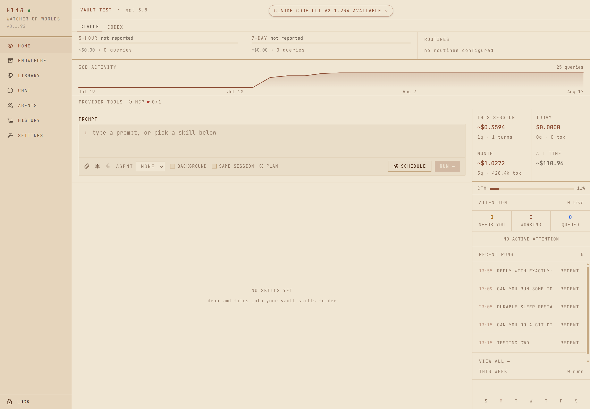

# Hlið

*Short for Hliðskjálf, Óðinn's high seat where he could see all nine realms.*

`Hlið` is the `Windows` command center I built for working with an `Obsidian`
vault through AI agents. It puts `Claude`, `Codex`, and installed
`Agent Client Protocol` providers in one place, so the tool calls, permission
prompts, vault, and all the setup around them are actually visible.

The app keeps its own data on the `Windows` machine, and it can work from other
devices over `Tailscale`. Prompts, selected references, and attachments still
go to whichever provider and runtime you pick for that turn. The vault can use
`PARA`, an `LLM` wiki layout, or its own folder names. As long as the paths are
set up, `Hlið` is happy.



## What it does

- Keeps agent sessions around with live streaming, visible tool calls,
  approvals, attachments, queued follow-ups, inline questions, plan review,
  and subagent activity. A turn waiting on a provider usage window survives a
  restart, and sleeping sessions stay visible in Attention until that window
  resets. Supported `Claude` and `Codex` chats can be forked whole, and `Claude`
  can branch from a specific reply or preview a checkpoint before rewinding its
  tracked file edits. Native `Codex` chats keep their goals and token budgets
  visible too. The provider, model, effort, and permission mode all stay with
  the chat they belong to.
- When provider-native subagents are not enough, agents can create durable
  child sessions owned by `Hlið`. Each one is a normal `Raven` session with its
  own provider, workspace, transcript, permissions, usage, and `Ledger` row.
  The parent and child links, attention state, steering, cancellation, and
  restart continuation all stay visible. None of that changes how native
  `Claude`, `Codex`, or `ACP` work.
- Pulls vault skills, reviewed skills managed by `Hlið`, provider-native
  imports, and slash commands into `Watch` and `Raven`. Compatible skills can
  run together too.
- Schedules one-time or repeating `Routines` from `Watch`. A run keeps its
  provider context, follows a narrow unattended permission policy, and can
  send the result to `Relics` or the vault.
- Points prompts at exact vault files, registered workspace files, and managed
  `Relics` through the shared `@` picker. A selection means *that file*.
  `Hlið` does not quietly pull in its links, imports, neighbors, backlinks,
  embeds, attachments, or anything related.
- Lets agents publish generated `HTML`, `PDFs`, images, and reports straight to
  `Relics` from a normal chat. The existing `Relics` previews stay as the viewer,
  and publishing does not need an `HTML` plan turn.
- Keeps provider-generated images in the conversation and in `Relics`, with the
  prompt, dimensions, preview, and download together. On a supported `Windows`
  host, `Codex` can also hand an interactive visualization to a fresh native
  worker and bring the sandboxed result back into `Raven` for zooming and
  full-screen inspection.
- Uses the official `Obsidian CLI` for the things only `Obsidian` knows about:
  the active note, indexed search, backlinks, tasks, properties, Bases, and
  local file history. Agents get a curated set of tools for reading and
  changing the vault through `Obsidian` itself. Writes still follow the chat's
  permission mode, and `Raven` shows a vault activity summary afterward.
- Browses notes and projects, searches without accents getting in the way,
  manages attachments, and tracks usage and cost. It can pause sessions near a
  provider limit, then pick them back up when the window resets.
- Puts `Claude`, `Codex`, and installed `ACP` providers behind the same session
  interface.
- Routes models from `CLIProxyAPI` `OAuth` accounts managed in `Forge` through
  `Claude Code`, `Codex`, and installed `OpenCode` `ACP`. `Ledger` keeps both the
  harness and the actual model identity for every route.
- Hands a task to a fresh `Windows`-native `Codex Computer Use` worker while
  keeping approvals, `Umbod` policy, and usage accounting inside `Hlið`.
- Runs `Whisper` locally for editable dictation. Native `Codex` chats can also
  take a recorded audio turn or use the separately gated `Raven Live` mode.
  Replies can be read aloud with a local device voice, `Microsoft` speech on the
  `Windows` host, a downloaded `Kitten` or `Piper` neural voice, or supported
  `Codex` realtime audio.
- Opens a real project shell in `Raven`. There is also an interactive
  `Claude CLI` mode for the times when the full terminal makes more sense than
  the structured chat `UI`. Agents can start a session-scoped `Project Preview`,
  inspect and control it at desktop, tablet, or mobile sizes, catch browser
  errors, move through retained captures, save an approved capture, and work
  from annotated visual feedback.
- Keeps linked vaults and workspaces, provider commands, permissions, scoped
  `MCP` servers, provider Apps and connectors, `ACP` agents, provider
  extensions, `Umbod`, networking, updates, and lifecycle controls together.
  Supported live `Claude` sessions can reconnect, enable, disable, or tighten
  approval for one `MCP` server without replacing the whole provider session.
  Source repositories can stay in `WSL` where they belong.
- Checks `Hlið`, `Claude`, `Codex`, and enabled `ACP` agents for updates. It
  shows the right command or in-app flow for each installation, but it does not
  quietly run installers.
- Works as a responsive `PWA` with built-in or custom desktop and mobile
  themes, pull-to-refresh, and a privacy mode for paths, filenames, and
  `Ledger` totals.

## Install it

`Hlið` is built for `Windows` and ships as one x64 executable.

1. Grab the latest `hlid-vX.Y.Z-windows-x64.exe` from
   [GitHub Releases](https://github.com/Kyle-Undefined/hlid/releases/latest).
2. Run it. The executable is currently unsigned, so `Windows SmartScreen` may
   complain. Check the filename, choose **More info**, then **Run anyway** if
   you trust the release.
3. `Hlið` copies itself to `%LOCALAPPDATA%\Hlid\hlid.exe`, refreshes the Start
   Menu shortcut, starts the local service, and opens the app in a browser.
4. Create the app password on the machine running `Hlið`. It needs 12 to 256
   characters, with no uppercase, number, or symbol ceremony.
5. Pick the `Obsidian` vault, check the detected folders, choose the default
   provider and permissions, then pick a theme.

The default address is `http://127.0.0.1:3000`. It stays on the local machine
until network access is turned on. The [user guide](docs/user-guide.md) covers
the full first-run flow and the optional `Tailscale` setup.

The `Obsidian CLI` integration is optional. If you have `Obsidian 1.12.7` or
newer, enable **Settings → General → Command line interface**, then check the
connection under **FORGE → Workspace → Obsidian desktop**. `Hlið` still browses
the vault directly when the `CLI` is not around.

## Where to start

- **WATCH** is for quick prompts, skills, slash commands, and scheduled
  `Routines`. A run can stay in the current session or head into the background
  while the dashboard keeps an eye on it.
- **RAVEN** is the full chat workspace. This is where the per-chat provider
  controls, goals, forks, voice, plans, approvals, exact context receipts,
  durable delegation, attachments, `Obsidian` actions, project terminal, and
  `Project Preview` live.
- **VAULT** browses notes, projects, memory, and skills, with a jump back into
  the `Obsidian` desktop when the `CLI` is connected.
- **FORGE** is where all the setup lives: providers, permissions, networking,
  voice, provider extensions, `Obsidian CLI`, `CLIProxyAPI`, `MCP`, `ACP`,
  `Umbod`, updates, and lifecycle controls.

The [user guide](docs/user-guide.md) gets into the meat and potatoes of each
page and the workflows that connect them.

## Pages

| Page | What it is for |
|---|---|
| **WATCH** (`/`) | Quick prompts, skills, slash commands, scheduled `Routines`, usage, `MCP` state, recent sessions, and vault context. |
| **VAULT** (`/vault`) | Notes, projects, memory, skills, and a jump into the matching `Obsidian` desktop note. |
| **RELICS** (`/relics`) | Attachments, plans, reports, and reviewed `Agent Skill` packages owned by `Hlið`. |
| **RAVEN** (`/raven`) | Full agent chat with provider controls, commands, goals, exact forks, voice, `@` references, plans, approvals, questions, queues, durable children, context receipts, a real project terminal, and `Project Preview`. |
| **EINHERJAR** (`/einherjar`) | Extra working directories or personality/context overlays. |
| **LEDGER** (`/ledger`) | Live-session controls, pinned and archived sessions, parent/child provenance, provider-history import, and analytics for tokens, cost, cache behavior, tools, stop reasons, context, and provider limits. |
| **FORGE** (`/forge`) | Settings, provider extensions, integrations, access, updates, maintenance, and developer tools. |

## Configuration and data

The packaged app keeps its executable, config, database, downloaded voice
models, and runtime data together under `%LOCALAPPDATA%\Hlid`.

`hlid.config.toml` holds the vault layout, providers, server and `TLS` ports,
network access, attachments, voice, `UI` preferences, and registered agents.
Most of it can be changed in `Forge`. A setting with a restart marker does not
kick in until `Hlið` restarts. Server, `ACP`, and `Umbod` changes are the main
ones that need it.

Working context is a little different. Reload the provider session so the
agent gets the new context. Refreshing the browser only reloads the `UI`.

`pricing-overrides.toml`, managed from **FORGE → Developer → Pricing**, adds
effective-dated model rates and aliases without touching the built-in pricing
code. Old priced `Ledger` rows stay frozen, so the history does not change out
from under you.

`Forge` can also keep separate custom palettes for desktop and mobile. The
model and effort defaults for `Codex Computer Use` live under **FORGE → Agents
→ Computer Use** and apply to the next one-shot `Windows` worker.

There is a small starting point in
[`hlid.config.example.toml`](hlid.config.example.toml). The
[Obsidian CLI bridge](docs/user-guide.md#obsidian-cli) covers the optional
desktop setup, note actions, agent tools, and approval behavior. The
[CLIProxyAPI integration](docs/user-guide.md#cliproxyapi-integration) covers
the routed harnesses, `OAuth` accounts, and exactly what `Hlið` records for them.

## Remote access and security

`Hlið` keeps authentication pretty small: one owner password. It stores an
`Argon2id` hash, then gives a successful browser an opaque `HttpOnly`
trusted-device session for 30 days. The first password can only be created on
the `Hlið` machine, and remote password login only works over `HTTPS`.

To use another device, open **FORGE → Access → Network** and follow the guided
`Tailscale`/`TLS` setup. By default, `Hlið` accepts localhost and
`Tailscale CGNAT` peers. Regular `RFC1918` LAN devices need the separate
local-network switch. The same server-side session protects `HTTP` routes,
`APIs`, chat `WebSockets`, and terminal `WebSockets`.

Lost the password? Run this on the `Hlið` machine and restart it:

```powershell
& "$env:LOCALAPPDATA\Hlid\hlid.exe" auth reset
```

That removes the credential and every trusted-device session. It leaves the
vault and app config alone.

## Working from source

You need [Bun](https://bun.sh/) `1.3.14` or something compatible, plus a local
`Obsidian` vault for interactive testing.

```bash
bun install
bun run dev:all
```

`dev:all` starts the `Vite` `UI` and the `Bun` `API`/`WebSocket` server. The `TLS`
proxy joins in when certificate paths exist in `hlid.config.toml`.

To run an isolated `Project Preview` for `Hlið`, pick a free `UI` port. The
`API`/`WebSocket` server grabs the following port automatically:

```bash
bun run dev:preview -- --port 4177
```

Pass that same `UI` port to `Project Preview`. This keeps it from fighting with
an installed `Hlið` or another source checkout on port `3000`.

I keep the useful checks pretty straightforward:

```bash
bun run check          # Biome, TypeScript, and changed-code Fallow analysis
bun run test           # Vitest suite
bun run test:db        # Bun-only database and auth tests
bun run validate       # Static checks, merged coverage, and full Fallow analysis
bun run build:win      # Windows executable build
```

`build:win` uses the reviewed `Whisper` archive from
`.cache/whisper/hlid-whisper-runtime-windows-x64-v1.9.1.zip` when it is
available. `Git` ignores that cache. The `Release` workflow builds and audits
the same runtime, passes it straight into the `Windows` build, and publishes it
under the `whisper-runtime-v1.9.1` release tag for clean builds.

`Ledger`'s **Import provider history** action finds `Claude CLI`, `SDK`, `Cowork`,
and `Codex CLI`, `Desktop`, and editor sessions on `Windows` and any `WSL`
distros you have set up. It stores the transcripts and usage in `Hlið`, then
makes those sessions resumable in `Raven`. It leaves out sessions created
through `Hlið`'s `Codex` bridge, so the same work does not get counted twice.
The dry-run-first `CLI` is still there for the odd recovery job.

```bash
bun scripts/import-provider-history.ts --db /path/to/hlid.db \
  --codex-root /path/to/.codex/sessions \
  --claude-root /path/to/.claude/projects

# Discover Claude and Codex history automatically.
bun scripts/import-provider-history.ts --db /path/to/hlid.db \
  --discover-claude --discover-codex

bun scripts/repair-codex-usage.ts --db /path/to/hlid.db \
  --rollout-root /path/to/.codex/sessions

bun scripts/repair-claude-usage.ts --db /path/to/hlid.db \
  --transcript-root /path/to/.claude/projects
```

Each command writes a `JSON` manifest first. Read it. If the plan looks right,
run the same command with `--apply`. Apply mode verifies a standalone `SQLite`
backup before it touches `hlid.db`. Current imports keep their source surface
and can be resumed in `Raven`. Older usage-only rows stay read-only until the
original transcript is found and imported again. You can run the same
provider-history discovery from `Ledger`'s actions menu, where `Hlið` handles
the backup for you.

Under the hood, `Hlið` is `TanStack Start/Router`, `React`, a `Bun` server,
`SQLite`, `WebSockets`, and an `AgentProvider` abstraction. The `Vite` client
and runtime assets are embedded into the executable, so there is no loose
`dist` folder to drag around with a release.

Tagged releases validate on `Linux`, build and smoke-test the executable on
`Windows`, then publish it with a `SHA-256` checksum. The
[release workflow](.github/workflows/release.yml) is the source of truth.

## License

[MIT](LICENSE). See [Third-party notices](THIRD_PARTY_NOTICES.md) for bundled
runtimes and downloaded speech models.
