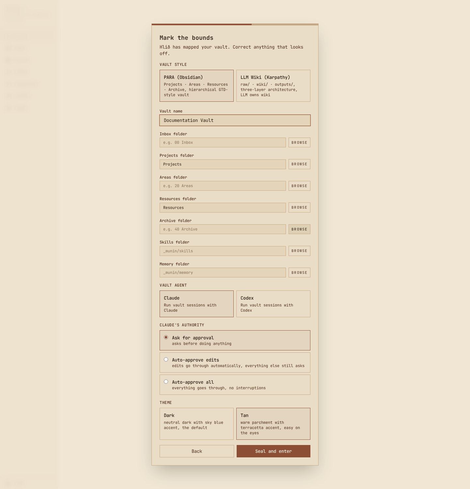
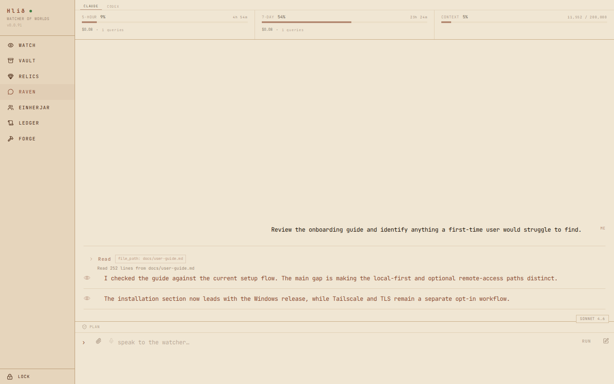
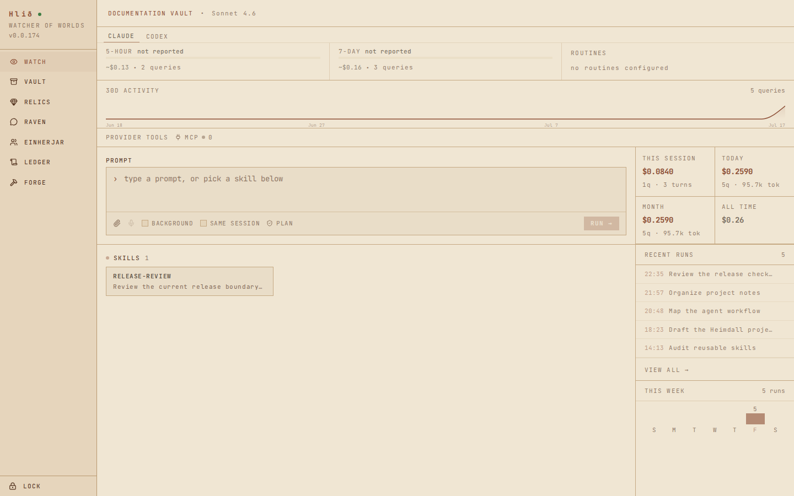
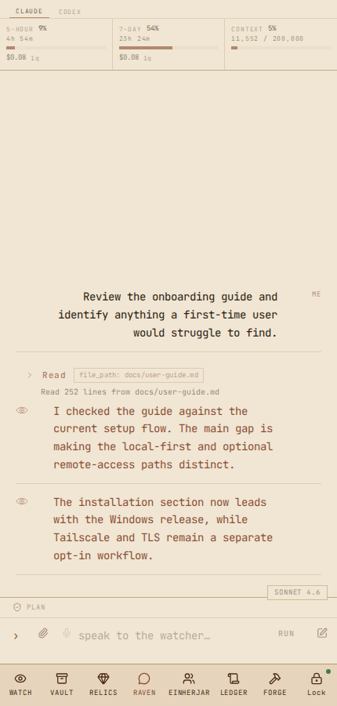
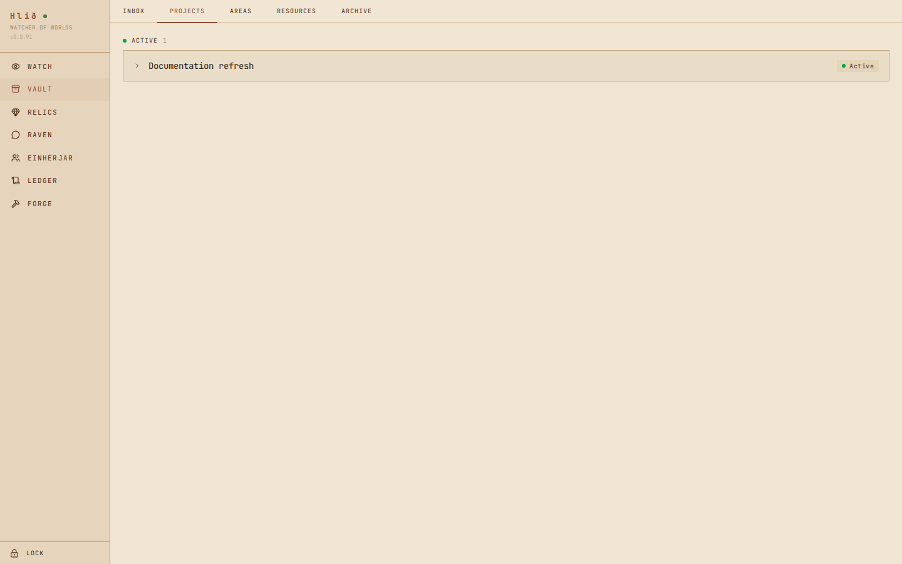
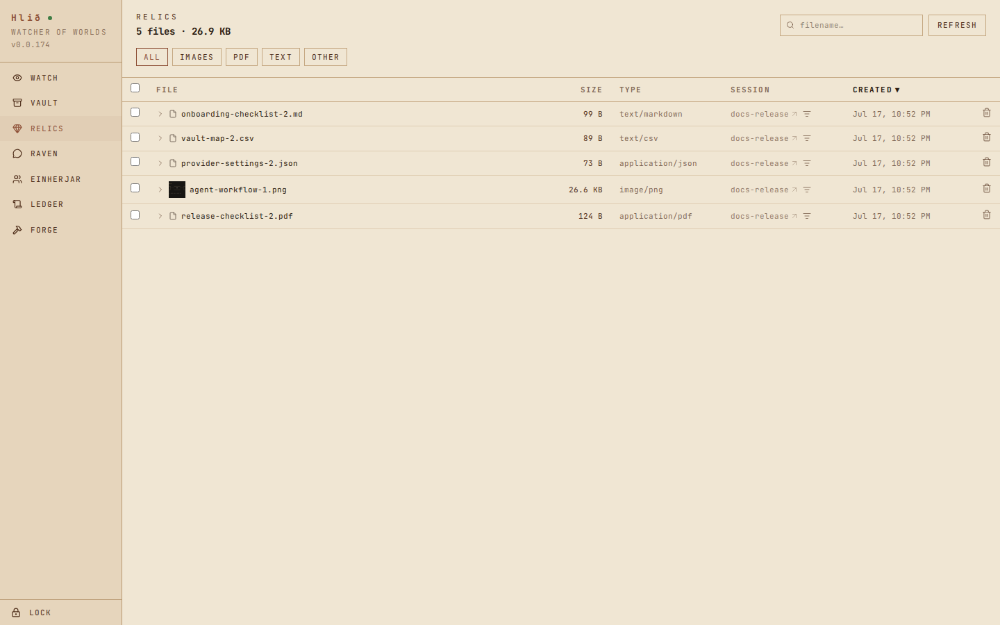
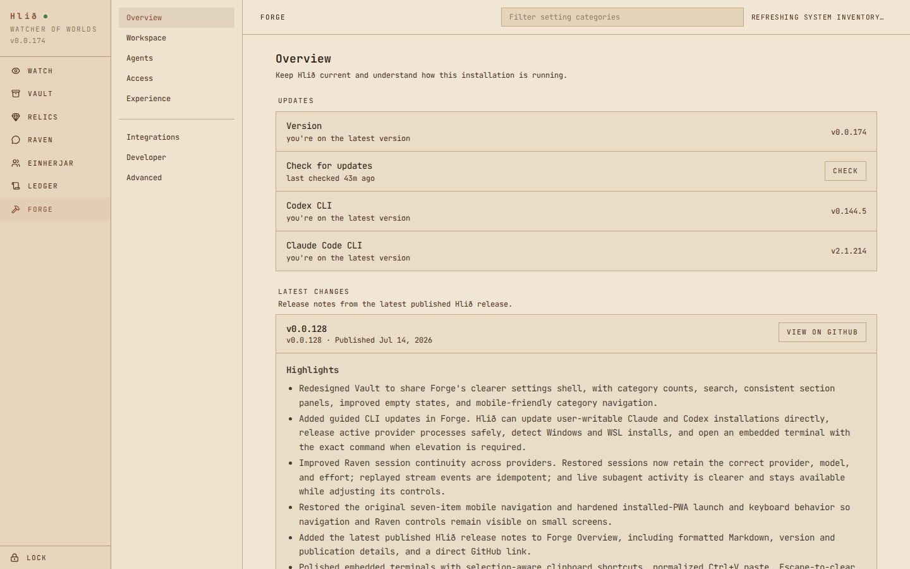

# Hlið user guide

`Hlið` is a local web UI for working with an `Obsidian` vault through `Claude`,
`Codex`, or another installed `Agent Client Protocol` provider. This guide is
for the packaged `Windows` app. If you are running from source, the
[README](../README.md#working-from-source) has the setup and validation commands.

## Install and first launch

1. Download the current `hlid-vX.Y.Z-windows-x64.exe` from
   [GitHub Releases](https://github.com/Kyle-Undefined/hlid/releases/latest).
2. Run it. `Hlið` is currently unsigned, so `Windows SmartScreen` may get in
   the way. Check the filename, choose **More info**, then **Run anyway** if you
   trust the release.
3. The downloaded executable installs the real copy at
   `%LOCALAPPDATA%\Hlid\hlid.exe`, refreshes the **Hlið** Start Menu shortcut,
   starts the service, and opens `http://127.0.0.1:3000`.

Use the Start Menu shortcut after that. Running `Hlið` again while it is already
up just opens the existing interface. Autostart is optional and lives in
`Forge`.

### Create the app password

The first browser on the `Hlið` machine shows **Create app password**. Use
12–256 characters. There is no uppercase, number, or symbol checklist.

Initial setup only works from the host machine. Once that is done, other trusted
devices can sign in over the `HTTPS` endpoint. A browser stays trusted for 30
days unless you lock it, change the password, or revoke every device in `Forge`.



*Pick the local `Obsidian` vault, then make sure the detected structure actually matches it.*

## Connect a vault

The first-run wizard has five small steps:

1. **Welcome** explains the page names.
2. **Vault** picks an existing local `Obsidian` vault. Hidden folders stay out
   of the folder picker.
3. **Structure** detects a `PARA` or wiki-style layout and fills in the folders
   it recognizes. Check the vault name, folder mappings, available default
   provider, that provider's permission mode, and the theme. Empty optional
   mappings are fine.
4. **Primer** explains how `Hlið`, the vault, and its skills fit together.
5. **Done** opens the app.

The wizard writes `hlid.config.toml` beside the installed executable. The same
settings live under **FORGE → Workspace** later. If the vault gets moved,
renamed, or disconnected, fix the path there before wondering why the vault
pages are empty.

## Run the first session

Open **RAVEN** and pick a provider. That provider needs to exist and already be
authenticated in its configured runtime, either native `Windows` or a `WSL`
wrapper.

The packaged app checks `Claude` and `Codex` during startup so provider-native
commands, models, subagents, and `MCP` status are ready before the first real
chat. If a provider is slow, `Hlið` finishes the check in the background. It
does not send a user turn or spend model tokens.

Pick an old session or start a new one. Typing `/` opens the shared command
picker, where vault skills, global skills, and provider-native commands live
together. Compatible commands can be stacked. Their badges stay above the
composer until they are removed or run.



*Tool calls stay in the conversation. No mystery spinner while the agent does who knows what.*

While a run is active:

- Tool calls show up inline and can be expanded when the details matter.
- Permission cards can approve once, approve for the session, save a permanent
  approval, or deny with feedback.
- Another prompt gets queued instead of interrupting the current turn. It can
  be promoted or canceled before it runs.
- Agent questions show their choices inline, with a note field when the buttons
  do not quite cover the answer.
- Plan mode waits for approval, revisions, or cancellation before the
  implementation turn. The `HTML` toggle opens an agent-authored plan in the
  sandboxed viewer.
- Supported providers show subagent status, current work, runtime, and usage.
- Long chats load the newest history first. **LOAD OLDER HISTORY** pulls in the
  earlier turns without jumping the scroll position around.
- Agent output can render tables, alerts, highlighted text, `Mermaid`, and
  `LaTeX` math using `$...$`, `$$...$$`, `\(...\)`, or `\[...\]`.
- The message copy button copies the rendered text.

Files can be dropped onto the composer or added with the attachment button.
Uploads can stay temporary for one session or become managed vault attachments.

## The pages

### Watch



*`Watch` is the landing page and the fastest way to throw work at an agent.*

**WATCH** runs a prompt or a compatible mix of vault, global, and
provider-native slash commands. It can target a registered agent, attach files,
use voice input, continue the current session, or send the run into the
background.

The rest of the page keeps live session state, provider usage, recent query
cost, seven- and thirty-day activity, the active provider's `MCP` status, and
recent sessions in view. When more than one provider reports usage, use the
provider tabs above the usage strip to switch between their reported windows.
`Hlið` keeps the last good readings in place while it loads new ones. Live
provider updates and a regular refresh keep them current. The draft survives
navigation and refreshes until it is run or cleared. Small thing, but boy does
losing a half-written prompt get old fast.

### Raven

**RAVEN** is the full agent workspace. Conversation history, provider controls,
slash commands, attachments, voice, tools, permissions, questions, plans,
subagents, and queued follow-ups all live here.

The badge above the composer changes the provider, model, effort, and permission
mode for that chat. Those choices stick to the session. So do the selected
agent, queued prompts, and unsent draft. Navigating away or refreshing the page
does not reset the whole thing back to whatever the vault default happens to be.

`Codex` skills can be composed with each other. `Claude` accepts up to six
compatible selections. An `ACP` session accepts one provider-native prompt
command at a time, but that command can still use vault skills. Switching the
active CLI drops commands that belong to the old provider instead of quietly
sending nonsense to the new one.

Turn on **Plan** when the agent should figure out the work before touching it.
Turn on **HTML** beside it for the full styled plan. Approval, cancellation, and
revision feedback all happen from the plan card or viewer.

The **Terminal** toggle opens a real login shell in the current vault or
registered-agent directory. Desktop puts it below the chat. Mobile switches
between Chat and Terminal tabs. Toggling the terminal off ends the shell, but
normal site navigation only detaches the browser. Come back to that chat and
the shell is still there.

If interactive `Claude` mode is enabled in `Forge`, `Raven` becomes a full
`Claude CLI` terminal instead of the structured timeline.



*Same session and controls, just fitted to the smaller screen without turning into button soup.*

### Vault



*`Vault` follows the folders and status words picked during setup.*

**VAULT** browses the configured note, project, memory, and skill directories.
Projects come from `YAML` front matter and the status vocabulary in
`hlid.config.toml`. `Hlið` does not impose its own project statuses on the
vault.

Text search ignores case and accents, so `Hlid` still matches `Hlið`. The same
normalization is used by `Relics`, `Ledger`, `Forge`, and the slash-command
picker.

### Relics



*`Relics` is everything that has moved through a `Hlið` session as a file.*

**RELICS** manages attachments. Ephemeral files belong to the session that
uploaded them. Vault attachments stay in the configured attachment folder.

Filename search updates while you type. The list can be filtered by date,
`MIME` group, or owning session, then sorted by size or creation time. If a new
upload lands while the page is open, a **NEW RELICS** pill appears instead of
yanking the list back to page one. Desktop gets the full table, while mobile
uses compact cards.

Deleting a vault attachment normally removes its managed record. Deleting the
source file too is a separate opt-in setting in `Forge`, because those are two
very different levels of "clean up."

### Ledger

**LEDGER** has two views: **Sessions** and **Stats**.

**Sessions** puts live processes above the recorded session list. Search labels
as you type, filter by agent or model, and sort by recent activity, cost, or
tokens. A drill-down from `Stats` carries its date, provider, model, or stop
reason filters into the list.

On mobile, the live rows collapse into a **LIVE SESSIONS** summary. Open it to
see sessions ordered with approvals and errors first, followed by running and
idle work. A session can still be opened in `Raven`, stopped, or closed from
that panel.

The overflow menu exports every session as `CSV` or `JSON`. It can also remove
records older than 7, 30, or 90 days when the database actually has sessions
that old. A row menu handles one rename or delete. Imported history rows are
accounting-only, so they stay read-only and cannot be opened as chats.

**Stats** filters by date range, agent, provider, and model. It breaks down cost,
priced coverage, input/output/cache tokens, activity, model share, tool use,
tool errors, stop reasons, and time-of-day patterns. Pick a model or stop-reason
segment to drill into the matching sessions.

Privacy mode masks the headline totals, sensitive chart labels, session names,
and paths. Handy when a screenshot is the goal and leaking the whole workspace
is not.

### Einherjar

**EINHERJAR** adds other agent directories. A `context` entry loads `AGENTS.md`
or `CLAUDE.md` as an instruction/personality overlay while keeping the vault as
the working directory. If both files exist, `AGENTS.md` wins because it is the
provider-neutral `ACP` contract. `CLAUDE.md` stays as the compatibility
fallback.

A `cwd` entry runs the agent from the registered directory instead. Paths
outside the vault need the external-agent switch in `Forge`.

### Forge



*`Forge` groups settings by what you are trying to change, not by whichever config object owns it.*

**FORGE** is split into these categories:

- **Overview** shows the current config and service state.
- **Workspace** holds the vault, folder mappings, and vocabulary.
- **Agents** holds provider, model, effort, permissions, usage limits, recaps,
  automatic usage-window sleep/resume behavior, and `Codex Computer Use`
  defaults when the Windows capability exists.
- **Access** has network, `TLS`, password, and trusted-device settings.
- **Experience** has built-in or custom desktop/mobile themes, input behavior,
  `HTML` plan defaults, voice, and browser-local privacy mode.
- **Integrations** manages `MCP`, `Umbod`, and the `ACP` catalog.
- **Developer** switches between the event log, local API reference, and pricing
  catalog.
- **Advanced** has database maintenance, provider-session reload, restart, and
  shutdown controls.

Most edits autosave. The header shows whether the form is saving, dirty, saved,
or waiting on a restart. Server, `ACP`, and `Umbod` changes are the main things
that set the restart marker. If a save or system inventory call fails, the same
header has a retry action.

The search box filters whole setting categories. `MCP` edits sync into the live
vault session. Working-context changes still need a provider-session reload,
which clears the live provider conversation but leaves its recorded `Ledger`
history alone.

**Agents → Auto-sleep on usage limit** pauses work near the provider's usage
threshold or after the provider reports a hard limit. `Hlið` uses the five-hour
window when it is available and weekly usage when it is not. The `Raven` banner
shows which window filled up and when the session should wake. **RESUME NOW**
wakes every sleeping session on that provider and lets them keep going until
the current window resets. Maximum sleep keeps a session from waiting longer
than the configured cap.

**Developer → Pricing** shows the built-in model and alias timelines, then edits
`pricing-overrides.toml` for local rules. Rates and aliases can use UTC
`effective_from` and `effective_until` dates, so a moving label like
`codex-auto-review` can change without an app release. Saving validates the
whole file before replacing it. Old priced rows stay frozen, and new fallback
estimates use the rule that was active at the query time.

The custom theme editor can start from the active, dark, tan, or desktop
palette. App, navigation, chat, `Ledger`, and chart colors are separate.
Desktop and mobile can have different palettes, and the native-control setting
keeps browser menus, inputs, and scrollbars readable against the result.

## Remote and mobile access

`Hlið` binds to `127.0.0.1` by default. Do not put port `3000` directly on an
untrusted network. Come on now.

For another device:

1. Install and authenticate `Tailscale` on the `Windows` host and the other
   device.
2. Open **FORGE → Access → Network** and use **Set up with agent**, or follow the
   manual steps shown there.
3. Generate a `Tailscale` certificate for the host's `MagicDNS` name and keep
   the certificate and private key under `%LOCALAPPDATA%\Hlid`.
4. Set the `TLS` certificate/key paths, turn on network access, and restart
   `Hlið`.
5. Open the `HTTPS` `MagicDNS` address shown in `Forge`. The default `TLS` proxy
   port is `3443`.
6. Sign in with the app password. The browser can install the `PWA` if an
   app-shaped window is useful on that device.

Remote password login and microphone capture both need `HTTPS`. `Hlið` accepts
localhost and `Tailscale CGNAT` peers by default. Only turn on regular `RFC1918`
LAN access for a network you actually trust.

## Voice and attachments

### Voice input

Open **FORGE → Experience → Voice**, download a `Whisper` model, select it, and
turn voice on. The model loads locally and stays warm for repeated
transcription. Switching models hot-loads the new one without a server restart.

In `Watch` or `Raven`, tap the microphone once to record and again to stop. On
desktop, the configured shortcut does the same thing. The default is
`Alt+Shift+V`.

The browser converts the recording to mono 16 kHz `WAV`, then the `Hlið` host
transcribes it locally. Audio does not become an attachment or a database row.
The text can fill the draft or send immediately, depending on the `Forge`
setting.

Remote microphone capture needs the `HTTPS` endpoint. If it is not working,
check browser permission, `HTTPS`, the selected model, and the voice toggle.

### Attachments

The default upload limit is 25 MB. Images, `PDF`, plain text, `Markdown`, `CSV`,
and `JSON` are allowed out of the box. Both the byte limit and `MIME` allowlist
live in `hlid.config.toml`.

Use an ephemeral attachment for throwaway session context. Use a vault
attachment when the file should still exist after the session is done.

## Windows Computer Use

`Windows Computer Use` only appears when `Hlið` runs on `Windows` with a native
`Codex CLI` and the `computer-use:computer-use` plugin installed and enabled.
Its status lives under **FORGE → Agents → Computer Use**.

The one-shot worker can inherit the calling chat's model and effort or use fixed
defaults. Select `/computer-use` in `Watch` or `Raven`, then describe the
Windows desktop task. `Hlið` starts a fresh native `Codex` worker and shows its
progress inline.

Every app approval still goes through the normal `Hlið`/`Umbod` policy. Session
and permanent approvals need an explicit choice. The worker closes when the job
is done, while its turns, duration, tokens, cache use, and estimated cost stay
in `Ledger`.

## Maintenance and troubleshooting

### Import or repair provider usage

These tools are for a source checkout, not the packaged app. They dry-run first
and write a `JSON` manifest before changing anything.

```bash
bun scripts/import-provider-history.ts --db /path/to/hlid.db \
  --codex-root /path/to/.codex/sessions \
  --claude-root /path/to/.claude/projects

bun scripts/repair-codex-usage.ts --db /path/to/hlid.db \
  --rollout-root /path/to/.codex/sessions

bun scripts/repair-claude-usage.ts --db /path/to/hlid.db \
  --transcript-root /path/to/.claude/projects
```

Add another root flag for archive directories. Read the manifest, then repeat
the command with `--apply` if the plan is right. Apply mode verifies source
hashes and a standalone `SQLite` backup before touching the database. Stop
`Hlið` before running maintenance against its live `hlid.db`.

### Updates and SmartScreen

`Hlið` checks `GitHub Releases` at startup and can check again from `Forge`. An
app update downloads a versioned executable and launches it through `Windows`
so `SmartScreen` can do its thing. Accepting that launch replaces the canonical
copy and restarts `Hlið`. Dismissing it leaves the current version alone.

`Hlið` also checks the installed `Claude` and `Codex` CLI versions. Enabled
`ACP` agents report their own versions, which get compared with the `ACP`
registry. Updates show in the global banner and under **FORGE → Overview** with
the command that belongs to that installation.

From a loopback browser or an authenticated `Tailscale` connection, **UPDATE**
can handle a user-writable installation. `Hlið` warns before stopping active
provider sessions, releases shared app-server processes, runs the known update
command, then checks the installed version again. Terminal sessions stay open.

An install that needs elevation, like a root-owned global `npm` package inside
`WSL`, gets **OPEN TERMINAL** instead. `Hlið` releases the provider, copies the
exact command, and opens a terminal in the matching distro and workspace. Paste
the command there so `sudo` can ask for the password itself. `Hlið` never asks
for, stores, or relays that password. Custom `ACP` executables keep using their
original installer.

Other LAN clients can see versions and copy guidance, but they cannot stop
sessions or launch an update.

Installed `PWA` clients pick up a new build through the service worker. It swaps
the cached assets and refreshes on the next load. No manual cache-clearing dance
needed.

### Autostart and lifecycle

`Forge` can add or remove the current executable from the per-user `Windows`
Run key. Restart and shutdown are in the same area. Autostart runs `Hlið` in the
background without opening a browser.

### Session reloads

Reload a provider session after changing its vault context or `MCP` setup. A
browser refresh only reloads the interface. It does not replace a provider
reload or a full `Hlið` restart.

### Reset a lost password

Run this on the `Windows` host, then restart `Hlið`:

```powershell
%LOCALAPPDATA%\Hlid\hlid.exe auth reset
```

That removes the password credential and every trusted-device session. Vault
data and application config stay put. The next local visit goes back to
**Create app password**.

### Remote login does not work

Check that the URL uses `HTTPS`, both devices are on the same `Tailscale`
network, `Forge` shows the expected `MagicDNS` name and certificate paths,
network access is on, and `Hlið` was restarted after the change. A normal LAN
IP also needs the local-network switch.

### The vault does not open

Open **FORGE → Workspace** on the host and check that the vault path still
exists and is a directory. Fix moved or renamed folder mappings, save, then
reload the provider session that uses them.
