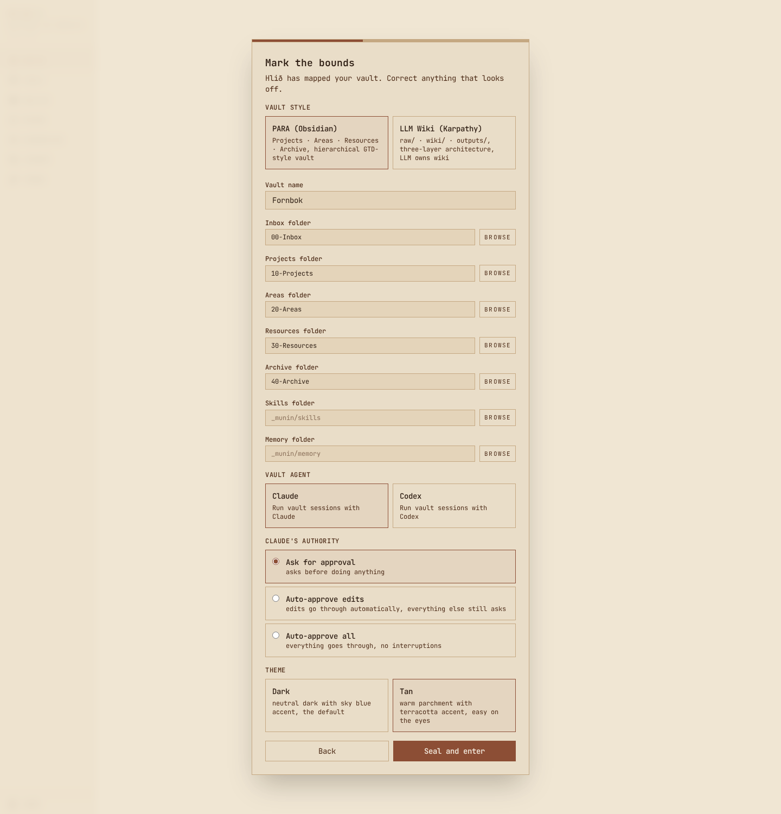
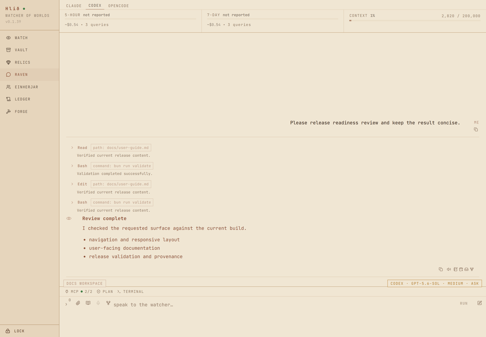
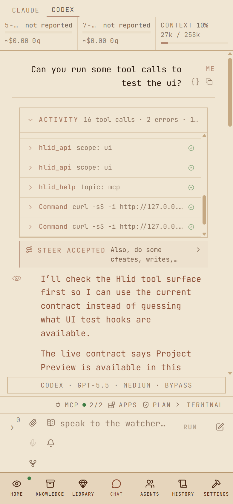
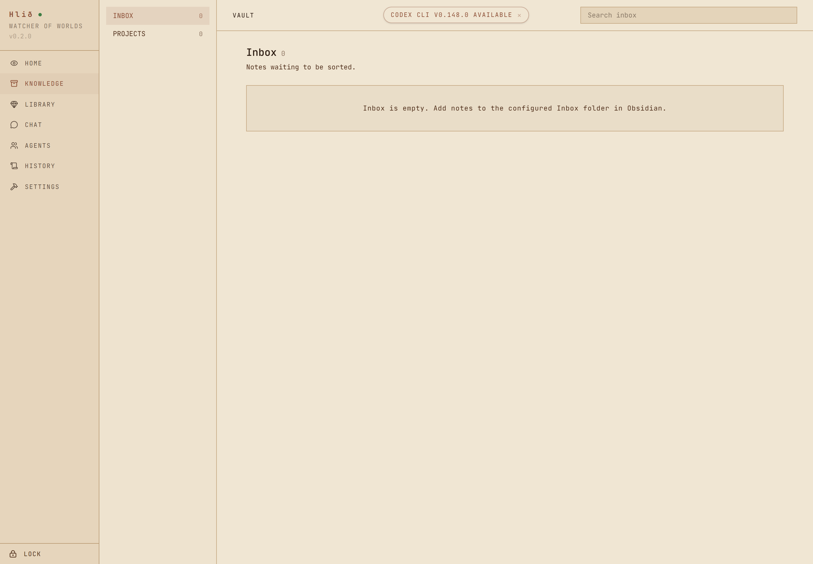
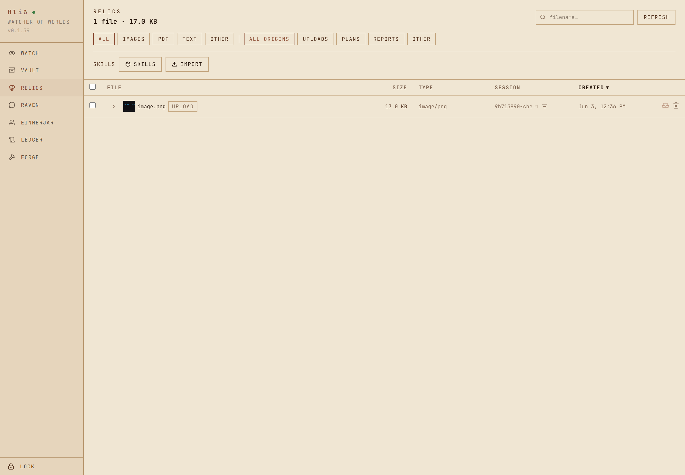
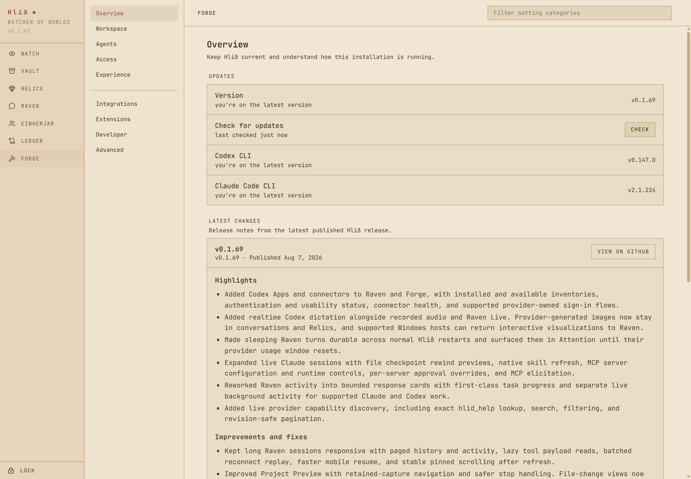

# Hlið user guide

`Hlið` is the local web `UI` I built for using `Claude`, `Codex`, or another
installed `Agent Client Protocol` provider with an `Obsidian` vault. This guide
covers the packaged `Windows` app. Running from source? The
[README](../README.md#working-from-source) has the setup and validation commands.

`Hlið` keeps its config, sessions, and managed library on the `Windows` host.
Each reference or attachment you pick stays exact. `Hlið` sends that selection,
along with the rest of the bounded turn context, to the provider you chose.

## Install and first launch

1. Download the current `hlid-vX.Y.Z-windows-x64.exe` from
   [GitHub Releases](https://github.com/Kyle-Undefined/hlid/releases/latest).
2. Run it. `Hlið` is currently unsigned, so `Windows SmartScreen` may get in
   the way. Check the filename, choose **More info**, then **Run anyway** if you
   trust the release.
3. The downloaded executable installs the real copy at
   `%LOCALAPPDATA%\Hlid\hlid.exe`, refreshes the **Hlið** Start Menu shortcut,
   starts the service, and opens `http://127.0.0.1:3000`.

Use the Start Menu shortcut after that. Running `Hlið` again while it is already
up just opens the existing interface. Autostart is optional and lives in
`Forge`.

### Create the app password

The first browser on the `Hlið` machine shows **Create app password**. Use
12 to 256 characters. There is no uppercase, number, or symbol checklist.

You have to do the initial setup on the host machine. After that, other trusted
devices can sign in over the `HTTPS` endpoint. A browser stays trusted for 30
days unless you lock `Hlið`, change the password, or revoke every device in
`Forge`.



*Pick the local `Obsidian` vault, then make sure the detected structure actually matches it.*

## Connect a vault

The first-run wizard is five small steps:

1. **Welcome** introduces the setup.
2. **Vault** picks an existing local `Obsidian` vault. Hidden folders stay out
   of the folder picker.
3. **Structure** detects a `PARA` or wiki-style layout and fills in the folders
   it recognizes. Check the vault name, folder mappings, available default
   provider, that provider's permission mode, and the theme. Empty optional
   mappings are fine.
4. **Primer** explains the page names and how `Hlið`, the vault, and its skills
   fit together.
5. **Done** opens the app.

The wizard writes `hlid.config.toml` beside the installed executable. You can
change the same settings later under **FORGE → Workspace**. If the vault gets
moved, renamed, or disconnected, check that path before wondering why the vault
pages are empty.

## Run the first session

Open **RAVEN** and pick a provider. That provider needs to exist and already be
authenticated in its configured runtime, either native `Windows` or a `WSL`
wrapper.

The packaged app checks `Claude` and `Codex` during startup. That gets their
native commands, models, subagents, and `MCP` status ready before the first real
chat. A slow provider finishes checking in the background. `Hlið` does not send a
user turn or spend model tokens just to do this.

Pick an old session or start a new one. Type `/` to open the shared command
picker. Vault skills, imports managed by `Hlið`, global skills, and provider-native
commands all live there. You can stack compatible commands, and their badges
stay above the composer until you remove or run them.

Need to point the agent at something without pasting half the vault? Type `@`
in the `Watch` or `Raven` composer. The picker searches exact vault files,
registered workspace files and images, and recent `Relics`. Each pick stays
attached to that turn, and a selection means only that file. `Hlið` does not go
wander through links, imports, neighboring files, backlinks, embeds,
attachments, history, or related material on its own. It resolves the real path
on the server and translates it for the selected `Windows`, `WSL`, or `ACP` runtime.
Those same references survive when a prompt gets queued behind a running turn.

The book button beside the normal attachment control grabs whichever note is
active in the `Obsidian` desktop and adds it as the same kind of exact vault
reference. Handy when the prompt is basically "look at what I am looking at."

### `CLIProxyAPI` integration

`Hlið` can add separate **Claude Code · CLIProxy**, **Codex · CLIProxy**, and
**OpenCode · CLIProxy** providers. The harness you pick still owns its agent
loop, tools, commands, permissions, and `MCP` behavior.
[`CLIProxyAPI`](https://github.com/router-for-me/CLIProxyAPI) handles the model
requests through a connected `OAuth` account. These routes are optional and sit
beside the normal `Claude`, `Codex`, and `ACP` providers.

Open **Forge → Integrations → CLIProxyAPI** and choose **Install managed**.
On `Windows`, `Hlið` downloads a reviewed, pinned release and checks it against
the `SHA-256` digest shipped with `Hlið`. It sets up a loopback-only config and
owns the process from there. `CLIProxyAPI` only updates with a `Hlið` release, after the
new archive has had some time to settle. The managed install includes matching
`Windows` and `Linux` binaries. `Hlið` starts the `Linux` sidecar inside each configured
`WSL` distro, so `WSL`-backed `Claude Code` and `Codex` harnesses keep their native
toolchain while sharing the same `OAuth` accounts.

`Forge` can connect `OpenAI Codex`, `Anthropic Claude`, `Google Antigravity`,
`Moonshot Kimi`, or `xAI` accounts. `OpenAI`, `Kimi`, and `xAI` use device-code
flows, which means you can finish signing in from the `Hlið` desktop or a mobile
browser without a localhost callback. `Claude` and `Antigravity` keep their
browser-callback flows on the `Windows` host. `Forge` opens the authorization
page, leaves a fallback link on screen, and shows the verification code when
you need one. `Hlið` starts the integration with the app, gives you an explicit
repair control, and can remove the binaries and every saved account.

If `Windows Security` quarantines the executable after extraction, check
**Protection history** before retrying. Once the reviewed file is allowed,
**Check / repair** puts the managed install back together.

The generated client key and `OAuth` tokens stay in `Hlið`'s private integration
directory. They never come back to the `Forge` `UI`. Remote management and the
`CLIProxyAPI` control panel are disabled because `Hlið` does not use either one.

Once `CLIProxyAPI` is enabled, its routes show up anywhere `Hlið` has a provider
picker. The `Claude Code` and `Codex` routes appear when their `CLIs` are installed.
`OpenCode` appears when its `ACP` command is installed. In `Forge`, choose its
exact execution target first. On a Windows host, supported official checksummed
binary releases can be installed either in `Windows` or in an exact configured
`WSL` distro. `Hlið` verifies and probes the binary in that target, and only
then offers **Enable**. Package-based, checksumless, and externally managed
commands keep their own installer and never give `Hlið` removal control. `Hlið`
injects runtime-only provider config for `Codex` and `OpenCode`. It does not rewrite
`~/.codex/config.toml`, `opencode.json`, or either harness's saved credentials.

For an existing, externally managed `CLIProxyAPI` process, configure advanced
mode in `hlid.config.toml`:

```toml
[cliproxy]
enabled = true
mode = "external"
base_url = "http://127.0.0.1:8317"
api_key = "replace-with-a-long-local-key"
model = "gpt-5.6-sol"
effort = "xhigh"
permission_mode = "default"
turn_recaps = true
```

Keep an external process on loopback. The `api_key` is a client-facing
`CLIProxyAPI` `api-keys` value, not a management secret. `Hlið` stores it in the
local config file but redacts it from browser config responses. The provider
health check verifies both the selected harness executable and the proxy model
catalog. `Forge` and `Raven` list every model in that catalog and put its upstream
owner in the label.

`Ledger` records the routed harness and the model that actually answered. `Hlið`
estimates known `OpenAI` and `Anthropic` models from its dated pricing catalogs. A
model without a matching rule, including supported `Google`, `Moonshot`, or `xAI`
models, stays explicitly unpriced. These estimates are `API`-equivalent
comparisons, not the amount charged to an `OAuth` subscription. Existing priced
rows stay frozen when rates change.

`Hlið` does not read `CLIProxyAPI`'s short-lived usage queue or import traffic
from other clients. `Ledger` only covers requests made through `Hlið`.
Account-wide quotas and subscription limits are not available as `Hlið` usage
windows, so automatic usage-window sleep does not apply to this route.



*`Activity` keeps a response's tool calls together without turning the
conversation into a wall of details.*

While a run is active:

- Each response keeps its tool calls in one **Activity** card. It summarizes
  running calls, errors, and steering, while provider task lists get their own
  progress rows. The card follows the live tail while open and collapses
  completed history by default. Long runs load earlier calls in bounded batches
  instead of mounting the whole tool transcript at once.
- Permission cards can approve once, approve for the session, save a permanent
  approval, or deny with feedback.
- Another prompt gets queued instead of interrupting the current turn. Supported
  `Claude` and `Codex` runtimes can fold it into the active run as steering. It can
  also interrupt and run next, or be canceled before it runs.
- Agent questions show their choices inline, with a note field when the buttons
  do not quite cover the answer.
- Plan mode waits for approval, revisions, or cancellation before the
  implementation turn. The `HTML` toggle opens an agent-authored plan in the
  sandboxed viewer. A pending plan stays visible when another trusted device
  opens the same session.
- Provider-native subagents and `Claude` workflows keep working the way their
  provider designed them. Delegation owned by `Hlið` is different. It creates a
  durable `Raven` child when the job needs another provider or configured
  workspace. Every `Hlið` child gets its own transcript, permissions, usage, and
  `Ledger` row. The parent shows its progress, anything that needs attention, and
  descendant rollups. From there it can inspect, steer, cancel, or explicitly
  continue eligible work interrupted by a `Hlið` restart.
- Long chats load the newest history first. **LOAD OLDER HISTORY** pulls in the
  earlier turns without jumping the scroll position around.
- Supported `Claude` runs can move active Bash commands and subagents into the
  background without ending the response. `Codex` can report native background
  terminals too. `Raven` keeps that provider work in a separate **BACKGROUND
  ACTIVITY** panel with recent output and the exact stop controls that provider
  exposes.
- Agent output can render tables, alerts, highlighted text, `Mermaid`, and
  `LaTeX` math using `$...$`, `$$...$$`, `\(...\)`, or `\[...\]`.
- Provider-generated images stay inline with their prompt, dimensions, download,
  and managed `Relics` copy. On a supported `Windows` host, `Codex` can also
  return a sandboxed interactive visualization that expands in the conversation
  and can be zoomed or maximized.
- The message copy button copies the rendered text.

Files can be dropped onto the composer or added with the attachment button.
Uploads can stay temporary for one session or become managed vault attachments.

## The pages

The main navigation defaults to **Home**, **Knowledge**, **Library**, **Chat**,
**Agents**, **History**, and **Settings**. Hlið's canonical page names remain
**Watch**, **Vault**, **Relics**, **Raven**, **Einherjar**, **Ledger**, and
**Forge**. I'll start with the two places that launch and supervise work, then
get into the browsers and settings around them.

**Settings → Experience → Navigation names** can switch the menu to Hlið's
canonical names or set a custom name for any menu item. This changes only the
visible desktop and mobile navigation labels. Routes, icons, page headings, and
Hlið's underlying terminology do not change, and an aliased link keeps its Hlið
name in its tooltip and accessible label.

### Watch


*`Watch` is the landing page and the fastest way to throw work at an agent.*

**WATCH** is the quick way to run a prompt or a compatible mix of vault, global,
and provider-native slash commands. Point it at a registered agent, attach
files, use voice input, continue the current session, or send the run into the
background.

The rest of the page keeps live session state, provider usage, recent query
cost, seven- and thirty-day activity, the active provider's `MCP` status, and
recent sessions where you can see them. If more than one provider reports
usage, the tabs above the usage strip switch between their reported windows.
`Hlið` leaves the last good readings in place while it fetches new ones, then
keeps them fresh through live updates and a regular refresh. Your draft also
survives navigation and page refreshes until you run or clear it. Small thing,
but boy does losing a half-written prompt get old fast.

Use **Schedule** to turn the current prompt into a `Routine`, or open it with an
empty draft to build one from scratch. A routine can run once, at a fixed
interval, daily, or on selected weekdays. It freezes the provider, model,
effort, agent directory, prompt inputs, and timezone with the definition, so a
later default change does not quietly alter the job.

`Routine` inputs can include prompts, skills, provider commands, exact vault
references, and retained `Relics`. Keep the result as a `Markdown` `Relic`, append
it to the daily note or another exact note, or make a new note in the mapped
Inbox or Raw folder. **Run now** is there for the sensible test before trusting
a schedule. The manager also shows run history and lets you pause, resume, or
archive the definition.

Unattended access is explicit. A routine can be read-only, use a reviewed set
of exact grants, or run with full access when `Umbod` also allows it. Exact
grants can cover a file operation, shell command, `Obsidian` action, `MCP` call,
or `Hlið` tool. Agent questions, plan exits, and `Windows Computer Use` are never
preapproved. If a run reaches anything outside its policy, it stops at
**Action required** instead of guessing what you meant. Overlapping runs are
skipped rather than piled on top of each other.

### Raven

**RAVEN** is the full agent workspace. This is where conversation history,
provider controls, slash commands, attachments, voice, tools, permissions,
questions, plans, provider-native subagents and workflows, children owned by `Hlið`,
context receipts, queued follow-ups, the project terminal, and `Project Preview`
all come together.

The badge above the composer changes the provider, model, effort, and permission
mode for that chat. Those choices stick to the session. So do the selected
agent, queued prompts, and unsent draft. Navigating away or refreshing the page
does not reset the whole thing back to whatever the vault default happens to be.

`Codex` skills can be composed with each other. `Claude` accepts up to six
compatible selections. An `ACP` session accepts one provider-native prompt
command at a time, but that command can still use vault skills. Switching the
active `CLI` drops commands that belong to the old provider instead of quietly
sending nonsense to the new one.

The picker keeps three kinds of execution separate. Vault skills or skills
managed by `Hlið` inject a skill file. Provider-native commands go back to that
provider. Capabilities owned by `Hlið`, such as `/review` and `/computer-use`,
follow its routing, approval, audit, and accounting path.

Agents check `hlid_help` to see which `Hlið` capabilities are available right now
and how to use one without guessing. For provider capability results,
`registry.providerDiscovery` says whether the catalog is current, captured from the
active provider adapter, or unavailable. A captured or unavailable discovery result,
or omission from a bounded page, is not proof that a provider feature is absent.
`hlid_api` gives agents the exact current
`HTTP` inventory through bounded, revision-bound pages. The returned host URLs
still require network reachability and `Hlið` authentication, so an agent uses a
typed `Hlið` tool when one exists. If a capability is not available, a similar
provider feature does not magically stand in for it. Provider-native capabilities
keep their own behavior.

The typed host tools include bounded reads for generated `Relics`, visible Raven
history, `Ledger` aggregates, the current session's context receipts, a redacted
`Event Log`, and safe `Routine` metadata and run history. Agents can also preview
a `Routine` schedule or restart an existing session `Project Preview`. These reads
do not widen references or bypass the approval and authorization flows for changes.
The matching focused help topics are `ledger`, `diagnostics`, and `routines`.

Structured provider actions stay out of the prompt text too. `/compact` tells a
supported `Claude` or `Codex` runtime to compact its active conversation. `/mcp`
refreshes the session's `MCP` inventory, and `/goal` manages a native `Codex` goal
without asking the model to interpret a pretend slash command. `/context` opens
`Hlið`'s context inspector. `/workflows` opens the native `Claude` workflow manager
when that runtime supports it. `/rename` changes the `Hlið` session label, and
`/archive` moves the current session into `Ledger`'s archived view.

The **APPS** control beside the composer appears when the selected provider has
an Apps catalog. It separates installed and available Apps from `MCP`
connectors, reports configuration, authentication, and current usability, and
can start a supported provider-owned authentication flow. The inventory is
scoped to the active provider account, this `Hlið` host, the selected workspace,
and, in `Raven`, the current session. An available listing is not the same thing
as an installed and usable App.

The **MCP** control shows the live server inventory for this provider context.
Supported live `Claude` sessions can reconnect a server or enable and disable it
without clearing the recorded conversation. When the session uses
**Auto-approve all** and `Umbod` is not enforcing approvals, one server can
inherit the session behavior, force **ask**, or use `Claude`'s native
**auto-check** classifier. A per-server choice can only tighten native approval;
it never bypasses `Hlið` policy. When a `Claude` `MCP` server needs structured
input, `Raven` shows the question inline with its server provenance and keeps it
there until you answer or decline it.

An `ACP` agent that advertises structured image or embedded-context prompts gets
native blocks for images you explicitly attach and references you explicitly
select. `Hlið` resolves and bounds only those exact selections. It does not
follow links, backlinks, embeds, attachments, imports, neighboring files, or
related notes. Agents without the matching prompt capability keep the normal
text fallback.

`Hlið` keeps a compact context receipt for supported turns. Open it from the turn
or with `/context` to see exactly what `Hlið` supplied: the provider selection,
skills, exact references, attachments, permissions, and other bounded context.
The receipt records where everything came from without copying the full contents
of a large selected file. Older receipts stay with their turns, so looking at
the current context does not rewrite history.

When `Claude` records a file checkpoint for a user turn, that message gets a
rewind control. `Hlið` always previews the affected files and line totals before
offering **REWIND FILES**. `Claude` only tracks edits made through its `Write`,
`Edit`, and `NotebookEdit` tools. `Bash` changes, directories, `Git` state,
other tool side effects, and conversation history are not rewound.

If `Claude` starts a new native context, such as after `/clear`, `Hlið` keeps the
recorded `Raven` conversation and inserts **Claude started a new native context**
at the boundary. The next turn uses the new `Claude` context. `Hlið` also refuses
messages sent from another `Claude` session instead of letting model-authored
text show up as if you wrote a new prompt.

`Claude` workflows stay `Claude` workflows. `/workflows` can inspect saved and
recent runs, open their exact source, run or rerun one, stop or resume supported
runs, save a generated workflow at a reviewed scope, or delete an exact saved
definition. `Hlið` adds the shared `Raven` controls and audit trail. It does not
pretend the workflow is some provider-neutral feature.

Native `Codex` chats show their current goal above the conversation. Use `/goal`
to open the editor, set an objective, and optionally give it a token budget.
`/goal pause`, `/goal resume`, and `/goal clear` manage it directly. The strip
shows elapsed time and token use, plus whether the goal is active, paused,
blocked, usage-limited, budget-limited, or complete. The goal stays with the
`Codex` thread.

Turn on **Plan** when the agent should figure out the work before touching it.
Turn on **HTML** beside it for the full styled plan. Approval, cancellation, and
revision feedback all happen from the plan card or viewer.

Completed assistant replies have `Obsidian` actions beside copy and read aloud.
One appends the reply to the active note, and another appends it to today's
daily note. If the vault has an Inbox or Raw folder mapped, a third action makes
a new timestamped note there. That capture can use the template selected under
**FORGE → Workspace → Vault**. Each action only sends the finished reply text,
and one save is limited to 20,000 characters.

The **Terminal** toggle opens a real login shell in the current vault or
registered-agent directory. Desktop puts it below the chat. Mobile switches
between Chat and Terminal tabs. Toggling the terminal off ends the shell, but
normal site navigation only detaches the browser. Come back to that chat and
the shell is still there.

The session-attention button collects live and restart-interrupted work without
switching sessions behind your back. It groups approvals, questions, errors,
running work, sleeping sessions, queues, forks, and delegated children. Queued
turns waiting on a provider usage window survive a `Hlið` restart. Pick one to
open its session directly, or hand the whole list to `Ledger`. The configurable
hotkey in `Forge` opens the same drawer.

Use `Hlið` delegation for work that needs to be durable and inspectable on its
own. A child starts in the parent's configured workspace by default and can use
another registered provider, but it must inherit the parent's permissions or
use narrower ones. The only parent-turn materials it can hand over are the
visible transcript, selected skills, exact current-turn `Vault` or `Workspace`
references, and durable `Relics`. It sends those only when the parent explicitly
chooses them.

Children stay in ordinary `Raven` and `Ledger` history after the parent turn ends.
Steering and cancellation owned by `Hlið` remain separate from the child provider's
native controls. The limits are three delegation levels, four active direct
children per parent, and twelve active delegated children across `Hlið`. Provider
silence is not a timeout, so stop work with an explicit cancellation. Only an
eligible restart-interrupted non-`Routine` child with an attempt left can be
continued. That continuation is an explicit new turn from a running parent.

When an agent starts a `Project Preview`, `Raven` adds **Preview** beside **Chat**
and **Terminal**. A session gets one preview at a time. Starting another replaces
the current one. `Hlið` owns the process, readiness checks, logs, four-hour safety
lifetime, and cleanup. Any requested working directory has to be relative to
the active workspace.

The agent can inspect the rendered page, navigate and interact inside the
preview origin, check console errors and failed requests, and switch between
fit, desktop, tablet, and mobile viewports. `Raven` can reload, restart, stop, or
open the preview in a normal browser. Agent captures are retained with their
route and capture time, so the Preview pane and historical capture cards can
move backward and forward through the session's frames. The feedback tool
captures the current frame so you can draw, highlight, add text, leave a
comment, and send the marked up image back to the session. Saving an exact `PNG`
into the workspace is a separate permissioned write.

Agent-controlled preview tabs use an isolated `Chromium` profile by default. If a
preview truly needs signed-in state, **FORGE → Agents → Browser profile** can
connect a running `Chromium` profile with your consent. That gives the preview
access to the profile's session state, so only do it with agents and projects
you trust.

An idle supported `Claude` or `Codex` chat gets a fork control beside the new-chat
button. It asks the provider for an exact copy of the whole conversation,
opens the copy, and leaves the source alone. The fork keeps a link back to its
source. `Claude` also offers **Branch from here** beside a completed assistant
reply when only the conversation through that point should come along. The
same whole-session fork is available from the row menu in `Ledger`. Current
`ACP` agents do not expose an exact fork.

If interactive `Claude` mode is enabled in `Forge`, `Raven` becomes a full
`Claude CLI` terminal instead of the structured timeline.



*Same session and controls, just fitted to the smaller screen without turning into button soup.*

### Vault



*`Vault` follows the folders and status words picked during setup.*

**VAULT** only browses folders mapped by the selected vault layout. A `PARA` setup
shows Inbox, Projects, Areas, Resources, Archive, Skills, and Memory. If an
existing `PARA` config has an explicit `outputs` mapping, it keeps showing Outputs.
A wiki layout can show Raw, Wiki, Outputs, Skills, and Memory. Empty or unmapped
categories stay out of the navigation. Projects come from `YAML` front matter
and the status words in `hlid.config.toml`. `Hlið` does not force its own project
statuses onto the vault.

Text search ignores case and accents, so `Hlid` still matches `Hlið`. The same
normalization is used by `Relics`, `Ledger`, `Forge`, and the slash-command
picker.

Expand a note or project and **Open in Obsidian** jumps the desktop app straight
to that file. Selected vault references in `Watch` and `Raven` get the same
shortcut, which is pretty useful when an agent points out the exact note that
needs a human pass.

### Relics



*`Relics` is the library owned by `Hlið` for attachments, plans, reports, and
imported skills.*

**RELICS** is where files owned by `Hlið` live. Uploads, generated `HTML` plans,
reports, and imported skill packages go under the installed app's `library`
directory instead of a repository or agent folder. The `Obsidian` vault and `WSL`
workspaces stay linked sources. `Hlið` does not copy or move them.

Ask for a durable deliverable and an agent can publish generated `HTML`, `PDFs`,
images, and other reports straight into `Relics` from an ordinary chat. `Hlið`
copies workspace files across the `Windows` or `WSL` boundary into managed storage,
links them to the chat, and returns a `URL` for the existing `Relics` viewer.
General `HTML` reports do not need plan mode. `HTML` plan proposals still use their
separate review workflow.

An agent can also search durable files generated and retained by `Hlið`, then read
one exact `Relic` by its ID. Search results omit filesystem paths, storage keys,
hashes, and workspace paths. Text and `HTML` come back as untrusted source, while
supported images use the provider's image result. Uploads, vault links, plans, and
temporary visualizations are not silently added to a search.

Use **Skills** to install a managed `Agent Skill` from a `GitHub` repository,
repository `URL`, or `skills.sh` `URL`. `Hlið` finds the available packages, stages
the revision you picked, and shows every readable file before installing
anything. Review and approve one package at a time. The installed copy then
appears in the `Watch` and `Raven` skill picker. Removing it from `Hlið` later does
not touch the source repository.

Use **Import** for skills already installed in a `Claude` or `Codex` registry or a
configured `ACP` workspace. Discovery does not start an agent or `CLI` process, so
the page stays responsive while those providers are busy. `Hlið` groups results
by provider and shows the scope, known enabled state, `Windows` or `WSL` runtime,
description, file count, and size. **Read SKILL.md** loads the complete source
on demand without sending its filesystem path to the browser. Pick the packages
you want and import them together. `Hlið`'s provider-neutral copy still works
when a provider has a skill with the same name. Removing the imported copy
leaves the provider's original alone, ready to import again if that seemed like
a better idea tomorrow.

**Refresh** rescans those installed provider skills. An established live
`Claude` chat refreshes its native skill list in place. A cold `Claude` chat
picks up the new list the next time it connects, and the on-disk import catalog
still refreshes either way.

The same managed files show up under `Relics` in the composer `@` picker. Pick
one there when an existing attachment, report, or generated plan needs to go
back into a prompt. It stays a reference to `Hlið`'s managed copy, so there is no
second upload to clean up later.

Filename search updates while you type. The list can be filtered by artifact
category, date, `MIME` group, or owning session, then sorted by size or creation
time. If a new upload lands while the page is open, a **NEW RELICS** pill
appears instead of yanking the list back to page one. Desktop gets the full
table, while mobile uses compact cards.

Deleting a vault attachment normally removes its managed record. Deleting the
source file too is a separate opt-in setting in `Forge`, because those are two
very different levels of "clean up."

### Ledger

**LEDGER** has two views, **Sessions** and **Stats**.

**Sessions** puts live processes above the recorded session list. Search labels
as you type, filter by agent or model, and sort by recent activity, cost, or
tokens. A drill-down from `Stats` carries its date, provider, model, or stop
reason filters into the list.

On mobile, the live rows collapse into a **LIVE SESSIONS** summary. Open it to
see sessions ordered with approvals and errors first, followed by running and
idle work. A session can still be opened in `Raven`, stopped, or closed from
that panel.

The overflow menu exports every session as `CSV` or `JSON`. It can also remove
records older than 7, 30, or 90 days when the database actually has sessions
that old. A row menu handles one rename or delete, pins a useful session to the
top, or moves it into the archived view. Archiving is reversible, clears its
pin, and protects the session from age-based cleanup. Supported idle `Claude` and
`Codex` rows also get the exact fork action.

Age-based cleanup previews the eligible sessions, messages, tool activity,
database payload, and managed attachments before confirmation. It skips live,
pinned, archived, imported, pending-turn, and protected delegation-lineage
sessions. Their usage totals stay in `Ledger` after the session payload is gone.

Delegated rows remember whether they are the parent or child and link back to
the other side in `Raven`. Parent summaries roll up duration, tokens, cost, and
descendant states across the tree. Each child still keeps its own provider and
session accounting. Once a child completes or fails, it becomes ordinary
history instead of pretending to be a live provider process forever.

**Import provider history** discovers `Claude CLI`/`SDK`/`Cowork` and `Codex`
`CLI`/`Desktop`/editor sessions from `Windows` and every configured `WSL` distro. `Hlið`
makes a checked `SQLite` backup, imports the transcripts and usage, and marks
the original surface on each row. Current imports can be opened and resumed in
`Raven`. Sessions that already came through `Hlið`'s `Codex` bridge are skipped so
their usage is not counted twice. Running the import again upgrades what it can
and leaves anything already current alone. Older usage-only imports remain
read-only if their original transcript is no longer available.

**Stats** filters by date range, agent, provider, and model. It breaks down cost,
priced coverage, input/output/cache tokens, activity, model share, tool use,
tool errors, stop reasons, and time-of-day patterns. Pick a model or stop-reason
segment to drill into the matching sessions.

Privacy mode masks the headline totals, sensitive chart labels, session names,
and paths. Handy when you need a screenshot without leaking the whole workspace.

### Einherjar

**EINHERJAR** adds other agent directories. A `context` entry loads the
instruction file for that entry's configured provider as an instruction or
personality layer while keeping the vault as the working directory. Claude
runtimes use `CLAUDE.md`; Codex and provider-neutral runtimes use `AGENTS.md`.

A `cwd` entry runs the agent from the registered directory instead. Paths
outside the vault need the external-agent switch in `Forge`.

Each `Einherjar` entry names the exact instruction file used by its configured
provider and exposes an **Open AGENTS.md** or **Open CLAUDE.md** action beside
the entry details. Opening it checks that one location, previews an existing
file for editing, or opens a missing file directly for creation. The list does
not scan every registered directory up front, and files for providers that are
not configured for that entry stay hidden.

### Forge



*`Forge` groups settings by what you are trying to change, not by whichever config object owns it.*

**FORGE** keeps the settings in these categories:

- **Overview** shows `Hlið` and provider `CLI` updates, installation and startup
  state, storage use, and the latest published release notes. The global update
  notice also surfaces updates for exact `Hlið`-managed `ACP` targets and opens
  their integration card, where the target-bound update is confirmed.
- **Workspace** holds the vault, folder mappings, vocabulary, and the optional
  `Obsidian` desktop `CLI` connection.
- **Agents** holds provider, model, effort, permissions, usage limits, recaps,
  vault and global instruction-file editors, the `Project Preview` browser
  profile boundary, automatic usage-window sleep/resume behavior, and
  `Codex Computer Use` defaults when the `Windows` capability exists. The vault
  editor follows the configured vault provider. Global files are shown only for
  provider families configured by the vault or an `Einherjar`, grouped by their
  `Windows` or `WSL` runtime. A provider's bounded capability snapshot reports its
  current, stale, partial, or unavailable status and separates integrated,
  provider-native, and unavailable behavior with its supporting runtime evidence.
  Edits take effect when the matching provider conversation starts or reloads.
- **Access** has network, `TLS`, password, and trusted-device settings.
- **Experience** has configurable navigation names, built-in or custom
  desktop/mobile themes, input behavior, the provider-entry visibility toggle
  for the `/` picker, `HTML` plan defaults, voice, and browser-local privacy
  mode. `Hlið` and vault entries always remain visible; the toggle controls
  every provider-badged skill, command, or plugin.
- **Integrations** manages provider Apps and connectors, `CLIProxyAPI`, `MCP`,
  `Umbod`, and the `ACP` catalog.
- **Extensions** manages installed `Claude` and `Codex` plugins and their
  marketplaces.
- **Developer** switches between the event log, local `API` reference, and pricing
  catalog.
- **Advanced** has database maintenance, provider-session reload, restart, and
  shutdown controls.

Most edits save on their own. The header tells you whether the form is saving,
dirty, saved, or waiting on a restart. Server, `ACP`, and `Umbod` changes are
the main ones that set the restart marker. If a save or system inventory call
fails, the retry action appears in that same header.

On `Windows`, **Overview → Updates → Hlid MCP in Claude Desktop** can add or
re-add `Hlið`'s agent and `Obsidian` vault servers to the standalone
`Claude Desktop` config. **Remove** clears only the entries managed by `Hlið`.
Restart `Claude Desktop` after either action so it loads the new config.

The search box filters whole setting categories. Vault `MCP` config stays scoped
to the vault, and each `Einherjar` entry keeps its own `MCP` config on that agent's
page. `Hlið` combines those compatibility files with provider-native and live
runtime discovery into one scoped inventory. It does not dump servers from
unrelated agents into one global list. `MCP` edits sync into matching supported
live `Claude` vault or `Einherjar` sessions. Other provider contexts need a
provider-session reload before working-context changes take effect. That clears
the live provider conversation but leaves its recorded `Ledger` history alone.

**Integrations → Apps and Connectors** shows each capable provider separately.
Installed and available Apps stay distinct from lower-level `MCP` connectors,
and every row reports whether it is configured, authenticated, and usable in
the current host and workspace. Supported OAuth flows open in the provider's
browser flow and `Hlið` refreshes readiness when authentication finishes.

An enabled `ACP` agent that advertises provider session listing gets **Browse
provider sessions** after a successful connection check. The browser reads only
bounded metadata for the exact configured workspace. It does not load a
conversation or copy its messages. **Import into Hlid** creates or reopens a
`Raven` entry with provider-native continuity; earlier transcript remains owned
by the provider and is not copied into `Hlið`. This is an explicit import, never
a `Hlið` fork. Import is offered only when the same agent also advertises native
session loading or resumption. List-only agents remain a metadata browser.

**Extensions** keeps the `Claude` and `Codex` inventories separate. Browse an
installed package or marketplace, filter by environment or category, and
review one package before installing it. The review shows its files and every
declared capability, including hooks, `MCP` servers, scripts, or apps. You can
also add or remove a marketplace source, then enable, disable, update, or remove
its packages through the provider's native registry. An idle runtime refreshes
right away. If a turn is running, `Hlið` leaves it alone and reloads the extensions
before the next turn.

**Agents → Auto-sleep on usage limit** pauses work near the provider's usage
threshold or after the provider reports a hard limit. `Hlið` uses the five-hour
window when it has one, otherwise it uses weekly usage. The `Raven` banner shows
which window filled up and when the session should wake. **RESUME NOW** wakes
every sleeping session on that provider and lets them keep going until the
current window resets. The sleeping turn and its queued follow-ups are stored in
the database, so a normal `Hlið` restart does not lose them. Maximum sleep keeps
a session from waiting past the configured cap.

**Developer → Pricing** shows the built-in model and alias timelines and edits
`pricing-overrides.toml` for local rules. Rates and aliases can use UTC
`effective_from` and `effective_until` dates. That lets a moving label like
`codex-auto-review` change without an app release. `Hlið` validates the whole file
before replacing it. Old priced rows stay frozen, and new fallback estimates
use whichever rule was active when the query ran.

The custom theme editor can start from the active, dark, tan, or desktop
palette. App, navigation, chat, `Ledger`, and chart colors are separate.
Desktop and mobile can have different palettes, and the native-control setting
keeps browser menus, inputs, and scrollbars readable against the result.

## `Obsidian CLI`

`Hlið` still reads the configured vault directly. The `Obsidian CLI` is an
optional extra, not another requirement. It handles the bits where `Obsidian`'s
own index and desktop state know more than a filesystem scan ever could.

Install `Obsidian 1.12.7` or newer and turn on **Settings → General → Command
line interface** inside `Obsidian`. Then open **FORGE → Workspace → Obsidian
desktop**. **Recheck** detects the installation without launching anything.
**Test connection** verifies the configured vault and may start the `Obsidian`
desktop if it is closed.

`Hlið` can find the installed `Windows` redirector even when `obsidian` is not on
`PATH`. A source build running inside `WSL` can use that same `Windows` install,
so there is no second `Obsidian` setup hiding in the sauce.

When the bridge is available, `Claude`, `Codex`, and installed `ACP` agents all
get the same curated `Obsidian` tools. They can search indexed text, inspect the
active or daily note, read exact notes, follow the link graph when asked, find
unresolved or orphaned notes, query tasks and properties, run Bases views, and
inspect or compare local file history. Broad queries return totals and
truncation details instead of dumping the whole vault out the wazoo. The agent
can narrow things down by path, status, view, or version, or just ask for a count
when that is all it needs.

The write side stays curated too. Agents can create notes with a core `Templates`
or `Templater` template, capture a quick note into the mapped `Inbox` or `Raw` folder,
open today's daily note, append or prepend text, replace one exact block, or
apply several exact replacements as one atomic patch. They can also add an item
through a `Base`, update one exact task or property, move or rename a file through
`Obsidian` so its links follow along, and send one exact file to trash through
`Obsidian`'s normal delete behavior. `Hlið` does not expose the permanent flag.

An agent has to read a note before making an exact replacement. If the expected
text is missing or appears more than once, nothing changes. An atomic patch
applies every replacement or none of them. `Raven` groups successful edits into
a **Vault activity** card with the affected paths, added and removed text
previews, and shortcuts back into `Obsidian`. File history stays read-only, so
recovery still happens in `Obsidian` itself.

Every note change follows the active agent permission policy. Arbitrary `Obsidian`
commands are stricter. The agent has to discover the exact command ID first, and
a new command still asks for approval even when the chat would normally bypass
permission prompts. **Always** trusts only that command in the configured vault.
Remembered commands show under **FORGE → Workspace → Obsidian desktop**, where
you can forget them again.

When `Obsidian` can report it, a command's vault activity shows the active note
before and after. Treat that as useful context, not a complete file diff. A
plugin command can touch more than the active note. Open the note in `Obsidian`
for the full history and recovery options.

## Remote and mobile access

`Hlið` binds to `127.0.0.1` by default. Do not put port `3000` directly on an
untrusted network. Come on now.

For another device:

1. Install and authenticate `Tailscale` on the `Windows` host and the other
   device.
2. Open **FORGE → Access → Network** and use **Set up with agent**, or follow the
   manual steps shown there.
3. Generate a `Tailscale` certificate for the host's `MagicDNS` name and keep
   the certificate and private key under `%LOCALAPPDATA%\Hlid`.
4. Set the `TLS` certificate/key paths, turn on network access, and restart
   `Hlið`.
5. Open the `HTTPS` `MagicDNS` address shown in `Forge`. The default `TLS` proxy
   port is `3443`.
6. Sign in with the app password. Install the `PWA` if an app-shaped window is
   useful on that device.

Remote password login and microphone capture both need `HTTPS`. `Hlið` accepts
localhost and `Tailscale CGNAT` peers by default. Only turn on regular `RFC1918`
LAN access for a network you actually trust.

## Voice and attachments

### Read aloud

Every completed assistant reply in `Raven` has a speaker control beside the
copy action. Nothing starts until you tap it. Once it is reading, the same
control pauses or resumes and a separate stop control ends playback.

Open **FORGE → Experience → Read aloud** to choose the speech engine, voice,
and reading speed. **Device browser** uses a local speech voice on the device
viewing `Raven`. `Hlið` excludes voices that the browser reports as remote.
**Microsoft host** uses a voice installed on the `Windows` computer running
`Hlið`, then plays the result as regular audio on the viewing device. That
option works from a phone connected through `Tailscale` and gives the browser
exact media pause and resume behavior.

**Local neural** uses a downloaded speech model and the `sherpa-onnx` runtime on
the `Hlið` host. `Forge` offers `Kitten Nano` and three single-voice `Piper` packs
as optional downloads with different tones and accents. `Kitten` is the
recommended default.

`Forge` shows each model's tier, download size, license, voice choices, `CPU`
thread setting, download progress, and a fixed voice preview. You choose each
download, and you can remove models separately. `Hlið` checks the runtime and
model archives before installing them. They are not packed into the executable.

Local neural speech runs in a separate child process, keeping native inference
off the main `Hlið` server. Replies start with a short opening chunk, then use
sentence-sized chunks with one prepared ahead. Playback can begin while the
rest of a long reply is still being generated. Only the selected model goes
into memory. The current speech runtime is `CPU`-based, while `Whisper` input can
use `Vulkan` on its own.

The speech engine, host voice, and reading speed live in the `Hlið` config and
apply to every device. The selected device-browser voice stays on that device
because every browser can expose a different voice list. `Microsoft`, neural, and
device speech all work without a cloud speech service. Audio generated on the
host travels to the viewing device over the current `Hlið` connection.

See [Third-party notices](../THIRD_PARTY_NOTICES.md) for the bundled `Whisper`
runtime and downloaded speech-model archives, checksums, source, and licenses.

Read aloud skips fenced code blocks, link addresses, and `Markdown` formatting.
It reads the finished response text, not tool activity or a reply that is still
streaming.

### Voice input

Open **FORGE → Experience → Voice input** and choose what the microphone should
do.
**Dictate with Whisper** makes editable text locally. Download a `Whisper`
model, select it, and turn voice on. The model loads locally and stays warm for
more recordings. Switching models hot-loads the new one without a server
restart. The packaged `Windows` app includes the reviewed `Whisper` runtime, while
speech models stay as separate downloads.

**Dictate with Codex · Preview** uses a realtime `Codex` session for the same
editable draft or automatic send flow. It works in `Watch` or `Raven` when native
`Codex` is selected, the main **Voice** toggle is on, and the **Developer
Preview** switch under **FORGE → Experience → Voice input → Codex realtime** is
on. Account and backend support are checked when the realtime session starts.
The selected coding model does not need audio input. It does not use the local
`Whisper` model, and its voice comes from the **Shared voice** setting used by
`Raven Live` too.

**Auto** uses a compatible `GPU` through `Vulkan` when it finds one, then falls back
to `CPU`. **CPU only** stays on `CPU`. `Hlið` reports the backend and device it picked,
but it does not install or update `GPU` drivers. **Whisper threads** controls `CPU`
transcription work and has nothing to do with `Vulkan`. Higher `CPU` values are
faster, but boy does it make the machine work for it. Changing the value reloads
the voice model. **Vocabulary hints** gives `Whisper` up to 50 preferred
spellings, one per line. It is handy for project names and technical terms the
old noggin does not want to correct after every recording.

In `Watch` or `Raven`, tap the microphone once to record and again to stop. On
desktop, the configured shortcut does the same thing. The default is
`Alt+Shift+V`.

For **Dictate with Whisper**, the browser converts the recording to mono 16 kHz
`WAV`, then the `Hlið` host transcribes it locally. The audio never becomes an
attachment or database row. Depending on the `Forge` setting, the text either
fills the draft or sends right away.

**Talk to Codex** records the full clip and sends it as a normal audio turn to
the selected native `Codex` model. It appears only when that model and account
support audio. Unlike dictation, it does not turn the recording into an
editable draft first.

With **Developer Preview** enabled, an idle native `Codex` chat also shows
**Raven Live** when the account and realtime backend support it. The selected
coding model does not need audio input. `Raven Live` uses **Shared voice** and
opens a live microphone session with two-way audio and a running transcript.
You can mute the microphone without ending the session. Stop Live before sending
a typed message or changing the chat controls. This is its own mode, not a
replacement for local `Whisper` or the normal recorded audio turn.

Remote microphone capture needs the `HTTPS` endpoint. If it is not working,
check browser permission, `HTTPS`, and the matching `Forge` voice settings. For
**Talk to Codex**, also check that the selected model accepts audio. Realtime
dictation and `Raven Live` use the separate account and backend gate.

### Attachments

The default upload limit is 25 MB. Images, `PDF`, plain text, `Markdown`, `CSV`,
and `JSON` are allowed out of the box. Both the byte limit and `MIME` allowlist
live in `hlid.config.toml`.

Use an ephemeral attachment for throwaway session context. Use a vault
attachment when the file should still exist after the session is done.

## Windows Computer Use

`Windows Computer Use` only appears when `Hlið` runs on `Windows` with a native
`Codex CLI` and the `computer-use:computer-use` plugin installed and enabled.
Its status lives under **FORGE → Agents → Computer Use**.

The one-shot worker can inherit the calling chat's model and effort or use fixed
defaults. Select `/computer-use` in `Watch` or `Raven`, then describe the
`Windows` desktop task. `Hlið` starts a fresh native `Codex` worker and shows its
progress inline.

This works from a `WSL`-backed chat because `/computer-use` is a `Hlið` capability,
not a command executed inside that `WSL` process. `Hlið` authorizes and audits the
handoff, then delegates the desktop task to the `Windows`-native worker. `Codex`'s
native per-application approval store remains the final app-access boundary.

Every app approval still goes through the normal `Hlið`/`Umbod` policy. Session
and permanent approvals need an explicit choice. The worker closes when the job
is done, while its turns, duration, tokens, cache use, and estimated cost stay
in `Ledger`.

## Maintenance and troubleshooting

Agents can use `Hlið`'s deferred maintenance tools to inspect storage, preview
age-based session cleanup, perform an approved cleanup, and run a lightweight
SQLite checkpoint and optimize pass. Cleanup previews are short-lived and bound
to the `Raven` session that requested them; if the impact changes, `Hlið` requires a
fresh preview. Cleanup preserves immutable Ledger usage while removing linked
`Hlið`-owned `Relics` and detaching vault-owned files.

Physical database reclaim remains a confirmed **Forge → Advanced** action. It is
not exposed as an agent tool or in Hlið's curated agent API. Reclaim rewrites the
database file and refuses to run while a Raven or terminal session is running.

### Import or repair provider usage

These tools are for a source checkout, not the packaged app. They dry-run first
and write a `JSON` manifest before changing anything.

```bash
bun scripts/import-provider-history.ts --db /path/to/hlid.db \
  --codex-root /path/to/.codex/sessions \
  --claude-root /path/to/.claude/projects

# Discover the current user's Claude and Codex history automatically.
bun scripts/import-provider-history.ts --db /path/to/hlid.db \
  --discover-claude --discover-codex

bun scripts/repair-codex-usage.ts --db /path/to/hlid.db \
  --rollout-root /path/to/.codex/sessions

bun scripts/repair-claude-usage.ts --db /path/to/hlid.db \
  --transcript-root /path/to/.claude/projects
```

Add another root flag for archive directories. Read the manifest, then repeat
the command with `--apply` if the plan is right. Apply mode verifies source
hashes and a standalone `SQLite` backup before touching the database. Current
imports include the transcript needed to resume from `Raven`; old
accounting-only rows can be upgraded when their original source is still
available. `Hlið` can stay open while these maintenance scripts run. Apply mode
uses the verified backup and finishes with a passive `WAL` checkpoint, so it
does not interrupt the live app.

### Updates and SmartScreen

`Hlið` checks `GitHub Releases` at startup and can check again from `Forge`. An
app update downloads a versioned executable and launches it through `Windows`
so `SmartScreen` can do its thing. Accepting that launch replaces the canonical
copy and restarts `Hlið`. Dismissing it leaves the current version alone.

`Hlið` also checks the installed `Claude` and `Codex` `CLI` versions. Enabled
`ACP` agents report their own versions, which get compared with the `ACP`
registry. Hlið-managed ACP installations update from their agent card in
`Forge`, using the same exact execution target and verification flow. Their
global notices identify the managed environment and open that integration; they
never expose the managed update through the generic `CLI` command runner.
External host ACP installations still show the command that belongs to their
installer.

From a loopback browser or an authenticated `Tailscale` connection, **UPDATE**
can handle a user-writable installation. `Hlið` warns before stopping active
provider sessions, releases shared app-server processes, runs the known update
command, then checks the installed version again. Terminal sessions stay open.

A `Claude` or `Codex` install that needs elevation, like a root-owned global
`npm` package inside `WSL`, gets **OPEN TERMINAL** instead. `Hlið` releases the
provider, copies the exact command, and opens a terminal in the matching distro
and workspace. Paste the command there so `sudo` can ask for the password
itself. `Hlið` never asks for, stores, or relays that password. New provider
sessions stay blocked until the explicit **Finish update and refresh** action
reconciles the runtime. While
the update terminal or a retryable runtime-refresh notice remains open in
`Forge`, `Hlið` renews that exact update lease. Its bounded expiry is crash and
abandonment recovery, not the expected end of a long-running update. Backdrop
clicks and `Escape` do not close the update terminal. An `OpenCode` `ACP` install
gets the same `npm` update flow only when its resolved package path or generated
Windows shim identifies `opencode-ai`. Custom executables and unrecognized
binary installs, including other external `WSL` `ACP` installations, keep using
their original installer outside `Hlið`.

Other LAN clients can see versions and copy guidance, but they cannot stop
sessions or launch an update.

Installed `PWA` clients pick up a new build through the service worker. It swaps
the cached assets and refreshes on the next load. No manual cache-clearing dance
needed.

### Autostart and lifecycle

`Forge` can add or remove the current executable from the per-user `Windows`
Run key. Restart and shutdown are in the same area. Autostart runs `Hlið` in the
background without opening a browser.

### Session reloads

Reload a provider session after changing its vault context or `MCP` setup. A
browser refresh only reloads the interface. It does not replace a provider
reload or a full `Hlið` restart.

### Reset a lost password

Run this on the `Windows` host, then restart `Hlið`:

```powershell
& "$env:LOCALAPPDATA\Hlid\hlid.exe" auth reset
```

That removes the password credential and every trusted-device session. Vault
data and application config stay put. The next local visit goes back to
**Create app password**.

### Remote login does not work

Check that the `URL` uses `HTTPS`, both devices are on the same `Tailscale`
network, `Forge` shows the expected `MagicDNS` name and certificate paths,
network access is on, and `Hlið` was restarted after the change. A normal `LAN`
`IP` also needs the local-network switch.

### The vault does not open

Open **FORGE → Workspace** on the host and check that the vault path still
exists and is a directory. Fix moved or renamed folder mappings, save, then
reload the provider session that uses them.
